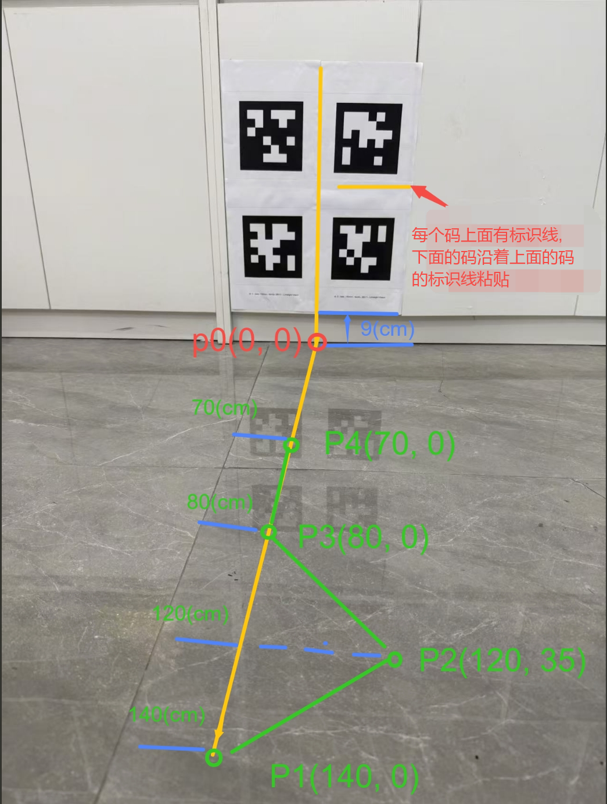

# 相机和底盘外参标定（高精度标定）

本章节介绍使用二维码（A4纸打印），实现相机和底盘之间x, y, x, roll, pitch, yaw外参的简单、高精度标定。
需要采用高精度标定的场景：相机和底盘之间yaw角较大，或者对标定精度有极高要求。简单、快速的粗标定能够满足基本使用需求。
本章节涉及到的所有操作均在RDK X5上运行。

## 安装标定工具

```bash
mkdir -p /userdata/vims/cam2base_calib
cd /userdata/vims/cam2base_calib
wget https://archive.d-robotics.cc/TogetheROS/files/vision_mobile_solution/tools/install_cam2base_calib_v0.02.tar.gz
tar -zxvf /userdata/vims/cam2base_calib/install_cam2base_calib_v0.02.tar.gz -C /userdata/vims/cam2base_calib
```

## 安装第三方依赖库

```bash
apt install ros-humble-rosbag2-storage-mcap -y
source /opt/tros/humble/local_setup.bash
source /userdata/vims/cam2base_calib/install/local_setup.bash
pip install -r "$(ros2 pkg prefix camera_extrinsic_calibration)"/requirements.txt
```

## 准备环境
下载至少4张不同Apriltag二维码，使用A4纸打印，二维码路径为：

```bash
source /opt/tros/humble/local_setup.bash
source /userdata/vims/cam2base_calib/install/local_setup.bash
cd `ros2 pkg prefix camera_extrinsic_calibration`/data/apriltag_pdf
```

将打印的Apriltag码在竖直面上集中水平粘贴，上下左右打印的Apriltag码紧贴在一起粘贴。
粘贴Apriltag下边缘距离地面9cm左右，前方为平整水平地面(不要在地毯地面采集数据)。
按照下图所示的坐标,在水平地面标记行走路径关键点:p1, p2, p3, p4。保证机器人运动过程左,右,前30cm内没有任何障碍物。
Apriltag粘贴以及路径标记示意图：



## 采集数据
### 启动双目深度估计和VIO
打开RDK X5终端，运行如下命令，包含双目深度估计，VIO：

```bash
source /opt/tros/humble/local_setup.bash
source /userdata/vims/install/local_setup.bash
cp -r `ros2 pkg prefix dnn_node_example`/lib/dnn_node_example/config .
YAML_CONFIG_FILE=`ros2 pkg prefix tros_vision_nav --share`/params/params.yaml \
odom_type=vio stereonet_pub_web=True run_pcl2grid=False run_rviz=False run_perc=False run_slam=False run_nav=False run_explore=False run_mask_depth=False robot_base=originbot bash `ros2 pkg prefix tros_vision_nav --share`/launch/run_launch.sh
```


> **注意**
1. 70mm基线（带IMU）不需要设置图像旋转，即启动时指定mipi_rotation=0.0。
2. 80mm以及其他基线（不带IMU）需要设置图像旋转，即启动时指定mipi_rotation=90.0。
3. 示例采用的移动底盘是originbot，如果采用的是其他底盘，使用robot_base参数指定。
>

检查odom话题和tf变换是否存在：

```bash
source /opt/tros/humble/local_setup.bash
ros2 topic delay -w 5 /odom
ros2 run tf2_ros tf2_echo base_footprint odom
```

### 启动录包

```bash
source /opt/tros/humble/local_setup.bash
mkdir -p /userdata/save_bag
cd /userdata/save_bag
ros2 bag record -s mcap --compression-queue-size 5 \
    /tf /tf_static \
    /odom \
    /StereoNetNode/rectify_left_image \
    /StereoNetNode/stereonet_pointcloud2 \
    /StereoNetNode/stereonet_depth/camera_info \
    /StereoNetNode/stereonet_depth
```

运行成功后将会有如下log信息：

### 控制机器人走"S型路线"
启动底盘控制节点：

```bash
source /opt/tros/humble/local_setup.bash
ros2 run teleop_twist_keyboard teleop_twist_keyboard
```

键盘按"z"将平移速度设置为0.14m/s, 如下显示:
currently:      speed 0.14      turn 0.28

为了保证采集数据的多样性, 按照如下要求控制机器人移动：
平移速度为0.14m/s
经过标记地面关键点:p1 -> p2 -> p3 -> p4 进行数据采集(可以沿着绿色线的路径行走)
途径每个关键点需要原地左右旋转30 °采集5s再继续运动
打开WEB可视化界面(web端打开:, 其中ip:为RKD-X5的ip), 确保机器人运动的过程中所有Apriltag的角点都在视野内。

移动完成后，停止录包。

## 开始标定
### 测量外参初始值
标定算法要求提供初始外参，初始值和真值测量的角度偏差不超过10(°), 平移偏差不超过0.01(m)。
参考 相机和底盘外参标定（粗标定） 章节测量初始外参。
### 运行标定脚本

```bash
source /userdata/vims/cam2base_calib/install/local_setup.bash
ros2 launch camera_extrinsic_calibration camera_extrinsic_calibration.launch.py \
    camera_color_topic:=/StereoNetNode/rectify_left_image \
    camera_pointcloud_topic:=/StereoNetNode/stereonet_pointcloud2 \
    camera_depth_topic:=/StereoNetNode/stereonet_depth \
    camera_info_topic:=/StereoNetNode/stereonet_depth/camera_info \
    bag_datasets_dir:=/userdata/save_bag \
    parser_output_dir:=/userdata/parser_output/ \
    init_extrinsics:="[0.01,0.03,0.15,0.0,0.0,0.0]"
```

注意！需要根据实际初始外参设置init_extrinsics，其值分别对应[rx, ry, rz, tx, ty, tz],其中rx, ry, rz为旋转角度, 单位: 度; tx, ty, tz为平移向量, 单位: 米。

标定脚本运行完成后，终端输出如下log：

```bash
[calib-run-1] ########################################################################################################### [calib-run-1] [2026-06-11 10:54:00]
[INFO] main.py:253 - You can set tf with cmd: 'ros2 run tf2_ros static_transform_publisher --x 0.000 --y -0.000 --z 0.150 --roll 0.002 --pitch -0.106 --yaw 0.177 --frame-id base_footprint --child-frame-id camera_link' [calib-run-1] ###########################################################################################################
```

### 更新标定参数
修改配置文件中calibration的参数，使用log中run tf2_ros static_transform_publisher提示的--x --y --z--roll --pitch --yaw分别进行设置：

```bash
# 打开配置文件
vi `ros2 pkg prefix tros_vision_nav --share`/params/params.yaml
# 使用标定结果中的--x --y --z--roll --pitch --yaw设置   robot_to_camera_x  robot_to_camera_y  robot_to_camera_z  robot_to_camera_roll  robot_to_camera_pitch
```

### 标定工具详细说明
标定原理、参数说明详见标定工具手册：

```bash
source /userdata/vims/cam2base_calib/install/local_setup.bash
# 打开标定工具手册
vi `ros2 pkg prefix camera_extrinsic_calibration`/README.md
```
