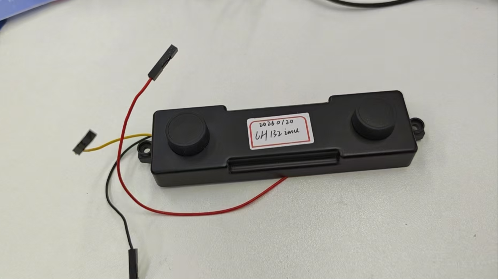
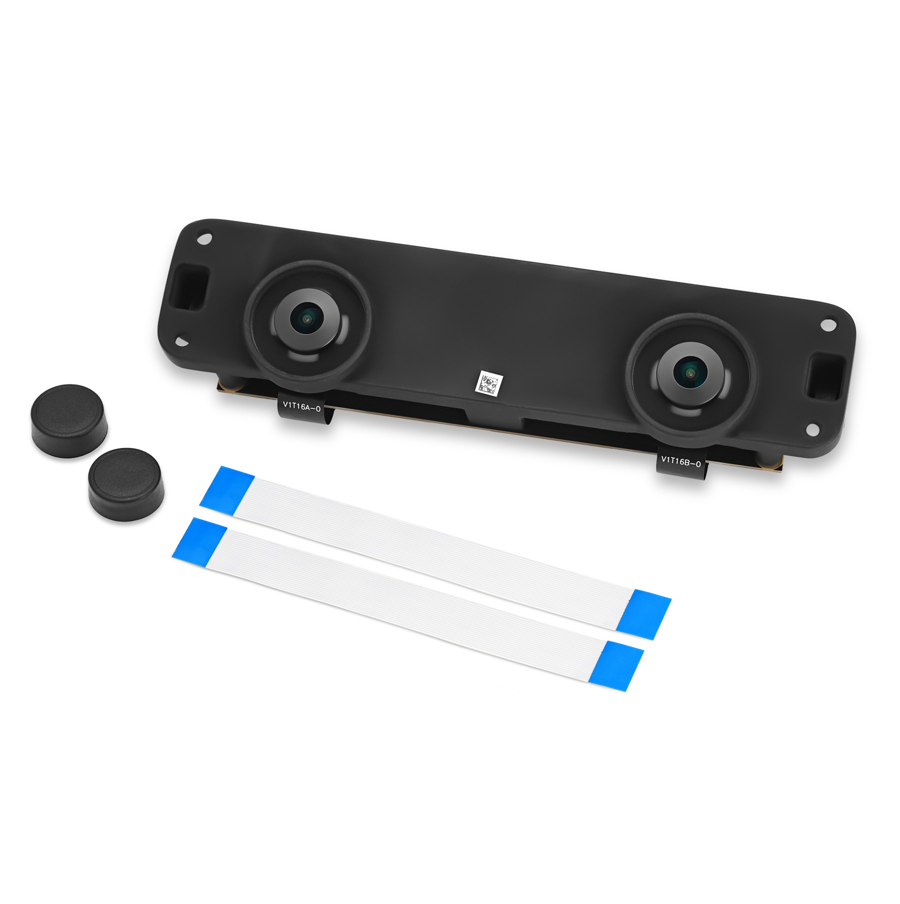
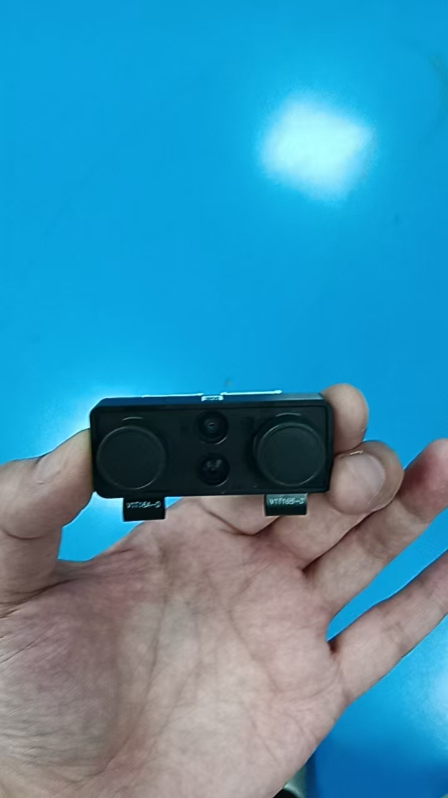
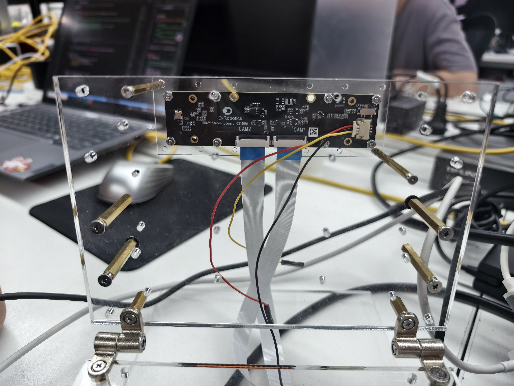
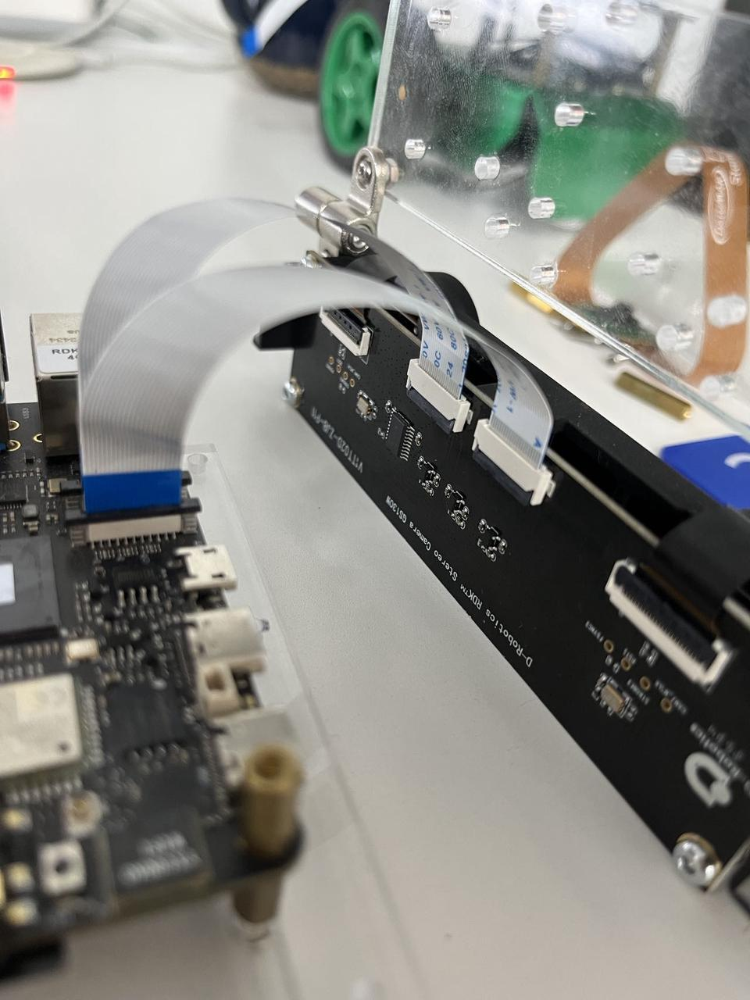
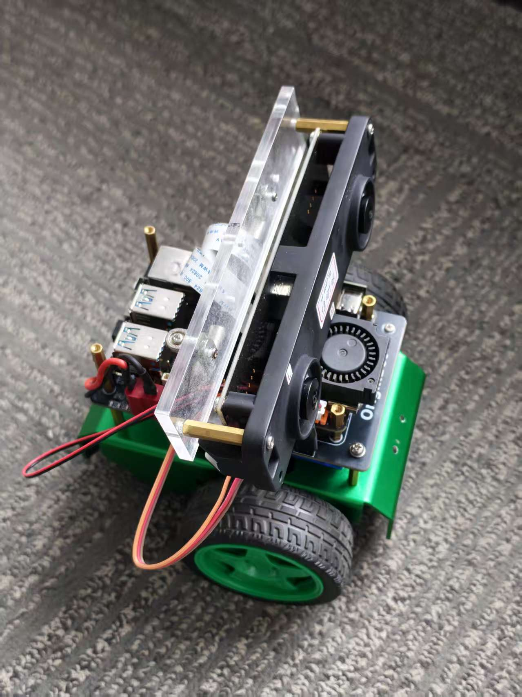
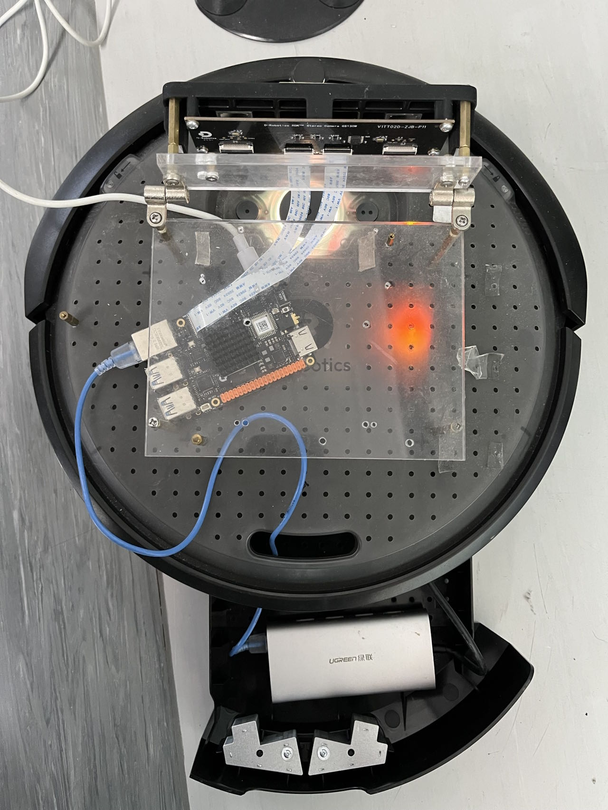
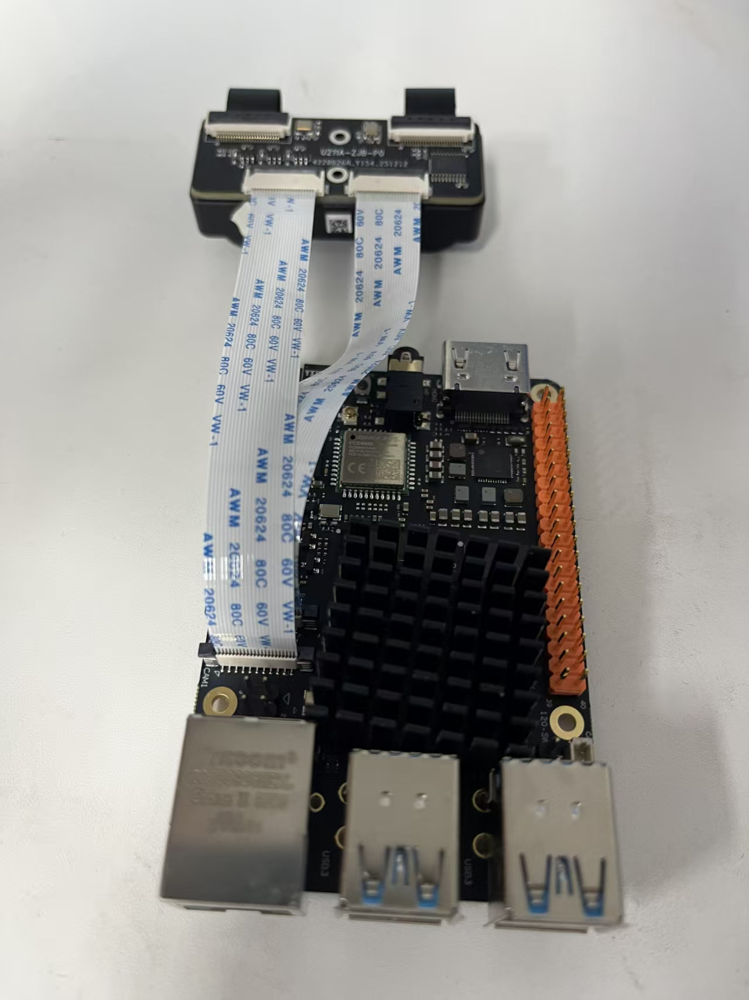
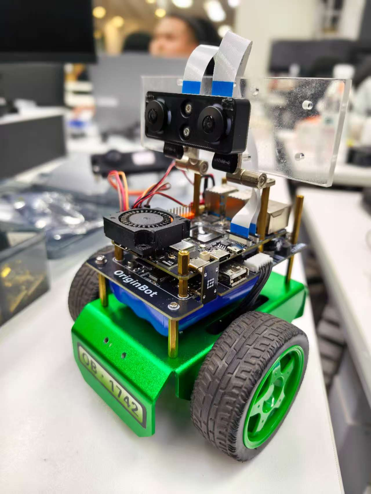
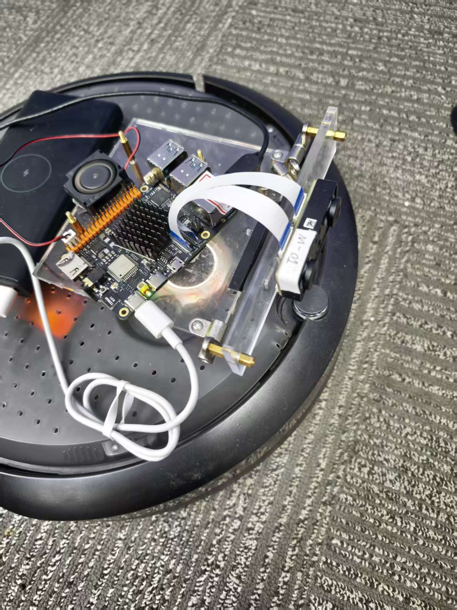

# 相机安装和配置手册

## 双目相机信息

| 
名称
 | 图片 | 资料链接 |
| --- | --- | --- |
| SC132GS双目相机（70mm基线，带IMU） 型号：RDK Stereo Camera GS130WI |  | [成品](https://archive.d-robotics.cc/TogetheROS/files/vision_mobile_solution/docs/moduls/d_robotics_rdk_RDK_stereo_camera_gs130wi_zh_v1_1.pdf) [规格书](https://archive.d-robotics.cc/TogetheROS/files/vision_mobile_solution/docs/moduls/D-Robotics-RDK-Stereo-Camera-GS130WI-20251013.pdf)  [尺寸图](https://archive.d-robotics.cc/TogetheROS/files/vision_mobile_solution/docs/moduls/RDK_Stereo_Camera_GS130WI.pdf) |
| SC132GS双目相机（80mm基线） 型号：RDK Stereo Camera GS130W |  | [点击查看](https://archive.d-robotics.cc/downloads/hardware/rdk_x5/RDK_Stereo_Camera_GS130W.pdf) |
| SC132GS双目相机（35mm基线） 型号：RDK Stereo Camera GS130W |  | [点击查看](https://archive.d-robotics.cc/TogetheROS/files/vision_mobile_solution/docs/moduls/132GS_35mm_U211A-200-0JG-20251127.pdf) |

### 安装双目相机

SC132GS双目相机安装在RDK X5上的示意图。

| 相机类型 | 相机和X5连接示意图 | 安装到OriginBot底盘 | 安装到Create3底盘 |
| --- | --- | --- | --- |
| 70mm基线（带IMU） |  |  | —— |
| 80mm基线 |  |  |  |
| 35mm基线 |  |  |  |

> **注意** 
1. 70mm基线（带IMU）不需要设置图像旋转，即启动时指定mipi_rotation=0.0。 
2. 80mm以及其他基线（不带IMU）需要设置图像旋转，即启动时指定mipi_rotation=90.0。
>