# iRobot Create3底盘配置

本文档介绍采用[iRobot Create3机器人底盘](https://iroboteducation.github.io/create3_docs/)涉及到的配置和安装说明：
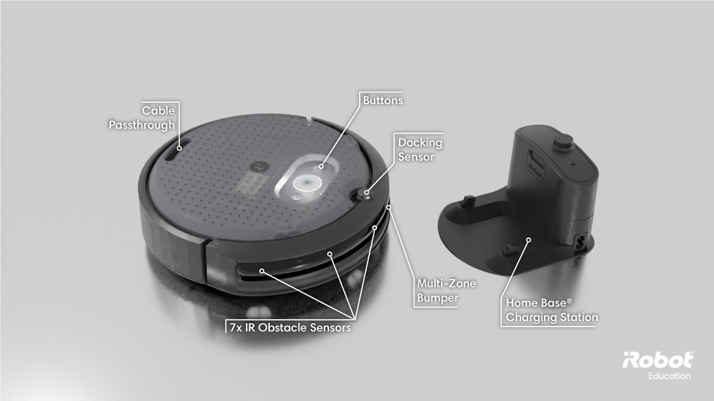

## 安装双目相机

参考[相机安装和配置手册](./device_camera.html)。

## RDK安装RDK X5

参考配置底盘的USB转网卡功能后，使用网线直连iRobot Create3和RDK X5。安装示意图如下：

| 说明 | 示意图 |
| :---: | :---: |
| USB转网卡连接底盘 | 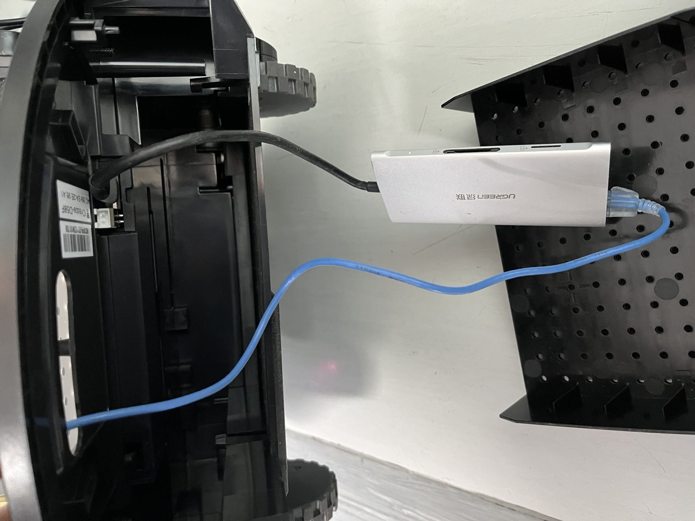 |
| RDK X5使用网线连接USB转网卡 | 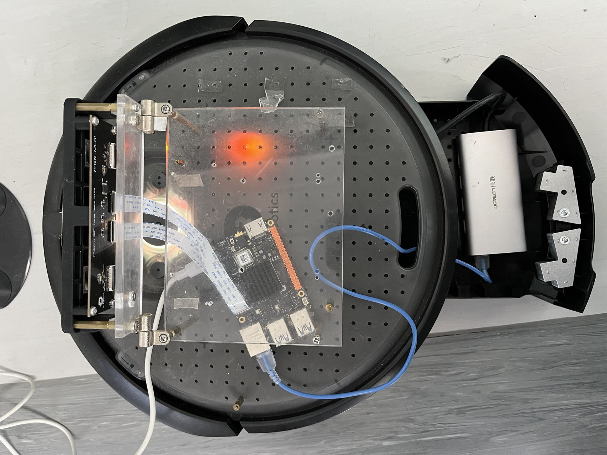 |

## Create3软件配置

以下软件配置均在Create3的网页端执行。
## 开关机和重启
开机
将底盘放置在充电座上充电，底盘将会自动开机。
关机
长按中间按键约5秒钟，直到听到关机声音并且按键上灯熄灭，表示机器已经关机。https://iroboteducation.github.io/create3_docs/hw/face/

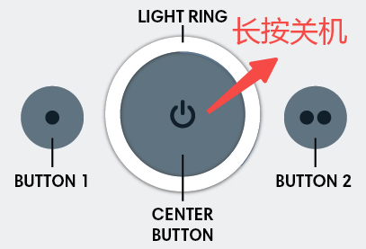

重启
关机后重新开机。
## 连接wifi
参考配置底盘连接wifi。

> **提示** 底盘配置完成后，可以不用连接wifi。 如果底盘未连接wifi，X5和底盘配置好有线网络连接后，可以在X5上打开底盘配置页面，方法是： X5上运行firefox（如打开失败，使用apt安装） firefox输入地址 http://192.168.186.2/ros-config
>

## ntp配置
将RDK作为ntp server，Create3为ntp client，同步RDK和Create3的时间。
网页端Beta Features 中选择 Edit ntp.conf，将RDK的有线网卡IP地址添加到SBC servers，保存后选择Restart ntpd重启ntp服务：

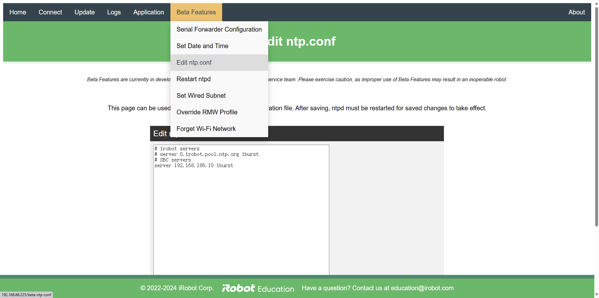

## 配置Namespace
将Namespace设置为/create3：

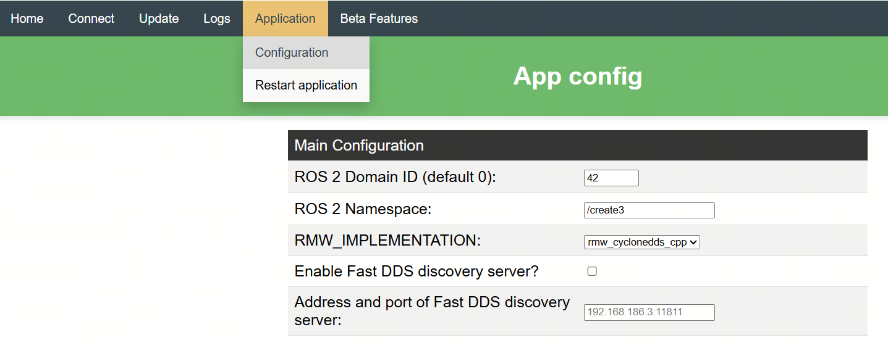

**软件配置**
为了降低 iRobot Create3 的CPU负载，在iRobot Create3的对底盘进行如下配置：
App config 中设置 ROS 2 Domain ID，与RDK X5环境配置章节配置的RDK X5的Domain ID一致。
App config 中设置 RMW_IMPLEMENTATION 为 rmw_cyclonedds_cpp ，切换为使用 CycloneDDS ，默认为 rmw_fastrtps_cpp。
App config 中设置 ROS 2 Parameters File ，禁止发布 odom tf ，由RDK端转发：

```bash
motion_control:
  ros__parameters:
    # safety_override options are
    # "none" - standard safety profile, robot cannot backup more than an inch because of lack of cliff protection in rear, max speed 0.306m/s
    # "backup_only" - allow backup without cliff safety, but keep cliff safety forward and max speed at 0.306m/s
    # "full" - no cliff safety, robot will ignore cliffs and set max speed to 0.46m/s
    safety_override: "none"

robot_state:
  ros__parameters:
    publish_hazard_msgs: false
    publish_odom_tfs: false
    raw_kinematics_min_pub_period_ms: -1
```

Beta Features 中设置 RMW Profile Override，绑定 eth0 网卡：

```bash
<CycloneDDS>
<Domain>
  <General>
     <Interfaces>
       <NetworkInterface name="eth0" />
     </Interfaces>
 </General>
</Domain>
</CycloneDDS>
```

iRobot Create3的网页端配置效果如下：

| 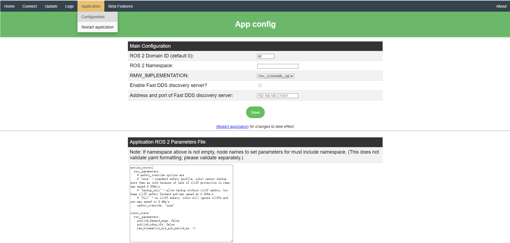 | 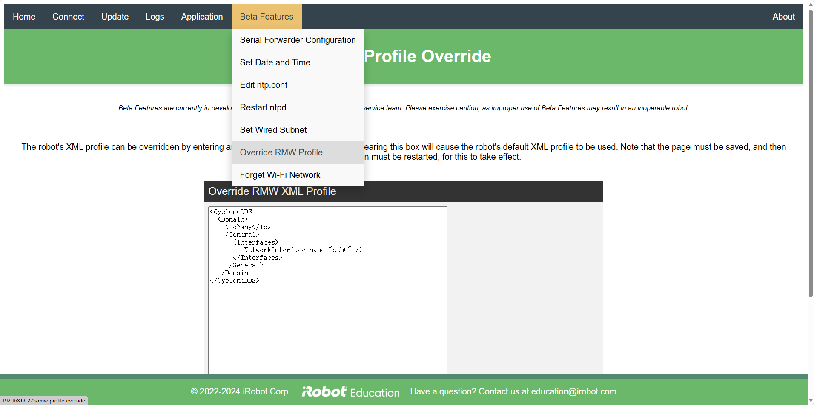 |
| --- | --- |

**配置生效**
重启底盘（Restart application），使配置生效：

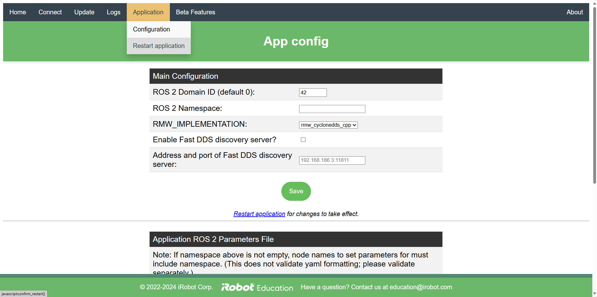

**参考资料**

## RDK X5其他配置

### 配置有线网络
配置RDK X5的有线网络，IP地址为192.168.186.10，参考。例如X5的有线网络配置如下：

```bash
# cat /etc/NetworkManager/system-connections/netplan-eth0.nmconnection
[connection]
id=netplan-eth0
uuid=f6f8b5a7-9e23-49b2-a792-dc589b3d3e88
type=ethernet
interface-name=eth0
autoconnect=true

[ethernet]
wake-on-lan=0

[ipv4]
address1=192.168.186.10/24,192.168.186.1
dns=8.8.8.8;8.8.4.4;
method=manual
route-metric=700

[ipv6]
addr-gen-mode=eui64
method=ignore

[proxy]
```

配置完成后，在RDK X5上使用ifconfig命令查看有线网卡eth0的IP地址是否和配置的一致：

```bash
eth0: flags=4163<UP,BROADCAST,RUNNING,MULTICAST>  mtu 1500
         inet 192.168.186.10  netmask 255.255.255.0  broadcast 192.168.186.255
         inet6 fe80::1870:35ff:fe83:fc7e  prefixlen 64  scopeid 0x20<link>
         ether 1a:70:35:83:fc:7e  txqueuelen 1000  (Ethernet)
         RX packets 18  bytes 1260 (1.2 KB)
         RX errors 0  dropped 0  overruns 0  frame 0
         TX packets 2713  bytes 876622 (876.6 KB)
         TX errors 0  dropped 0 overruns 0  carrier 0  collisions 0
         device interrupt 38
```

RDK X5上执行如下命令，查看网络联通（192.168.186.2是底盘的有线网络地址）：

```bash
ping 192.168.186.2
```

### ntp配置
将RDK作为ntp server，Create3为ntp client，用于同步RDK和Create3的时间。

配置方法[参考](https://iroboteducation.github.io/create3_docs/setup/compute-ntp/)。

例如X5上此`/etc/chrony/chrony.conf`配置文件如下：

```bash
# Welcome to the chrony configuration file. See chrony.conf(5) for more
# information about usable directives.

# Include configuration files found in /etc/chrony/conf.d.
confdir /etc/chrony/conf.d

# This will use (up to):
# - 4 sources from ntp.ubuntu.com which some are ipv6 enabled
# - 2 sources from 2.ubuntu.pool.ntp.org which is ipv6 enabled as well
# - 1 source from [01].ubuntu.pool.ntp.org each (ipv4 only atm)
# This means by default, up to 6 dual-stack and up to 2 additional IPv4-only
# sources will be used.
# At the same time it retains some protection against one of the entries being
# down (compare to just using one of the lines). See (LP: #1754358) for the
# discussion.
#
# About using servers from the NTP Pool Project in general see (LP: #104525).
# Approved by Ubuntu Technical Board on 2011-02-08.
# See http://www.pool.ntp.org/join.html for more information.
pool ntp.ubuntu.com        iburst maxsources 4
pool 0.ubuntu.pool.ntp.org iburst maxsources 1
pool 1.ubuntu.pool.ntp.org iburst maxsources 1
pool 2.ubuntu.pool.ntp.org iburst maxsources 2
# Enable serving time to ntp clients on 192.168.186.0 subnet.
allow 192.168.186.0/24
# Serve time even if not synchronized to a time source
local stratum 10

# Use time sources from DHCP.
sourcedir /run/chrony-dhcp

# Use NTP sources found in /etc/chrony/sources.d.
sourcedir /etc/chrony/sources.d

# This directive specify the location of the file containing ID/key pairs for
# NTP authentication.
keyfile /etc/chrony/chrony.keys

# This directive specify the file into which chronyd will store the rate
# information.
driftfile /var/lib/chrony/chrony.drift

# Save NTS keys and cookies.
ntsdumpdir /var/lib/chrony

# Uncomment the following line to turn logging on.
#log tracking measurements statistics

# Log files location.
logdir /var/log/chrony

# Stop bad estimates upsetting machine clock.
maxupdateskew 100.0

# This directive enables kernel synchronisation (every 11 minutes) of the
# real-time clock. Note that it can't be used along with the 'rtcfile' directive.
rtcsync

# Step the system clock instead of slewing it if the adjustment is larger than
# one second, but only in the first three clock updates.
makestep 1 3

# Get TAI-UTC offset and leap seconds from the system tz database.
# This directive must be commented out when using time sources serving
# leap-smeared time.
leapsectz right/UTC
```

### 配置cyclonedds
终端下执行vi /userdata/cyclonedds_config_file.xml命令，插入以下命令后保存：

```bash
/userdata/cyclonedds_config_file.xml <CycloneDDS>   <Domain>     <Id>any</Id>     <General>       <Interfaces>         <NetworkInterface name="eth0" />       </Interfaces>     </General>   </Domain> </CycloneDDS>
```

终端下执行以下命令，将配置命令放在启动脚本中执行，使每个终端生效：

```bash
echo "export CYCLONEDDS_URI=/userdata/cyclonedds_config_file.xml" >> ~/.bashrc
```

## 通信测试

测试RDK X5和iRobot Create3之间的通信，在RDK X5上执行命令：

```bash
# 使配置生效
source ~/.bashrc
source /opt/tros/humble/local_setup.bash
# 查看Create3发布和订阅的topic。
ros2 topic list
# 查看订阅odom数据的delay
ros2 topic delay -w 5 /odom
```

输出如下：

| 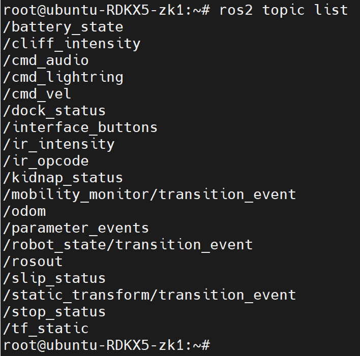 | 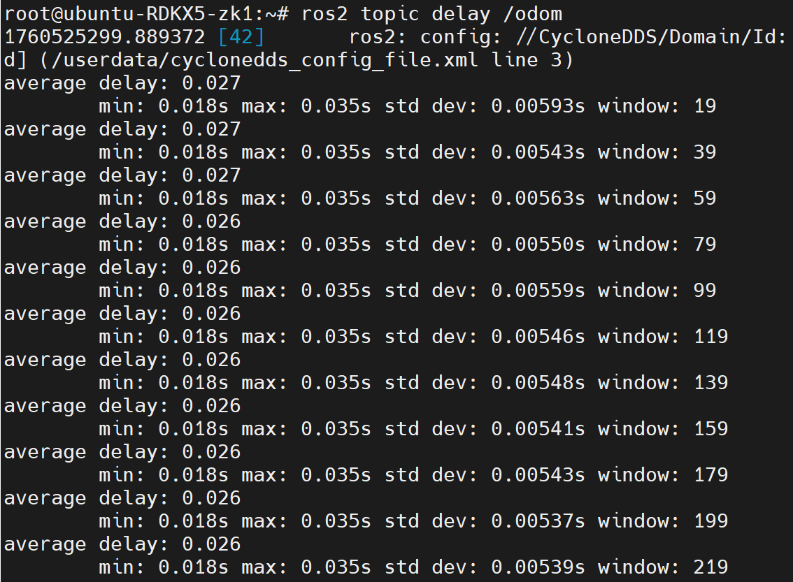 |
| --- | --- |


> **注意** odom数据的delay范围为0.030（单位秒）左右，如果偏差比较大，请检查ntp配置是否正确（参考Create3软件配置章节和RDK X5其他配置章节）。如果已经正确配置ntp后delay依然比较大，请将底盘关机后重启。
>

## 键盘控制
打开终端，启动键盘控制功能包，使用键盘控制机器人移动：

```bash
source /opt/tros/humble/local_setup.bash
ros2 run teleop_twist_keyboard teleop_twist_keyboard --ros-args -r /cmd_vel:=/create3/cmd_vel
```