# FAQ

## 常用模式配置

### 选择底盘

修改配置文件中robot的参数，设置底盘类型（originbot/myrobot/create3），其中`myrobot`表示自定义底盘，需要根据实际情况修改。

```bash
# 打开配置文件 
vi `ros2 pkg prefix tros_vision_nav --share`/params/params.yaml 
# 将"robot_base"参数设置为 originbot/myrobot/create3
```

### 选择相机参数

修改配置文件中camera参数组中的mipi_rotation配置项，根据相机类型设置旋转角度：

```bash
# 打开配置文件
vi `ros2 pkg prefix tros_vision_nav --share`/params/params.yaml
# 设置mipi_rotation为90.0/0.0
```

> **注意** 
1. 70mm基线（带IMU）不需要设置图像旋转，即启动时指定mipi_rotation=0.0。 
2. 80mm以及其他基线（不带IMU）需要设置图像旋转，即启动时指定mipi_rotation=90.0。
>

### 选择里程计
修改配置文件中switch参数组中的odom_type配置项，选择里程计来源：

```bash
# 打开配置文件
vi `ros2 pkg prefix tros_vision_nav --share`/params/params.yaml
# 设置odom_type为wheel/vio
```

配置说明：
wheel 表示轮式里程计。
vio 表示视觉里程计

> **注意** 只有70mm基线（带IMU）相机支持vio。
>

### 选择运动类型

SLAM建图默认采用的机器人运动类型为2D平面移动，如果机器人为3D运动（机器人运动过程中存在roll/pitch/z轴高度的变化），需要将SLAM建图设置为支持3D运动模式。
修改配置文件中rtabmap参数组中的rtabmap_Reg_Force3DoF（设置为False）和rtabmap_Mem_UseOdomGravity（设置为True）配置项，打开支持3D运动模式：

```bash
# 打开配置文件
vi `ros2 pkg prefix tros_vision_nav --share`/params/params.yaml
# 设置  rtabmap_Reg_Force3DoF: "'False'"
# True=3DoF(xy+yaw), False=6DoF
# 设置  rtabmap_Mem_UseOdomGravity: "'True'"
# True=use VIO orientation as gravity ref
```

> **注意** 只有当里程计类型为vio时，才SLAM建图才支持3D运动模式。如果里程计类型为wheel，禁止打开SLAM建图的3D运动模式。 只有70mm基线（带IMU）相机支持vio。
>

## 使用OriginBot轮式里程计

地瓜机器人对OriginBot的MCU程序进行了重构和优化，包括数据采集频率、轮速采集计算周期、硬件同步数据触发、时间同步等功能，使最终EKF融合出的odom更准。

如使用OriginBot轮式里程计，请确保下载和烧写本章节提供的固件。
1. [下载固件](https://archive.d-robotics.cc/TogetheROS/files/vision_mobile_solution/originbot/mcu/OriginBot_Firmware_dbb59.hex)
2. [烧写固件](https://www.originbot.org/guide/firmware_install.html)。


## 双目相机和深度估计
双目相机相关问题参考[双目MIPI图像采集](https://developer.d-robotics.cc/tros_doc/quick_demo/demo_sensor#%E5%8F%8C%E7%9B%AEmipi%E5%9B%BE%E5%83%8F%E9%87%87%E9%9B%86)。
深度估计相关问题参考[双目深度算法](https://developer.d-robotics.cc/tros_doc/boxs/spatial/hobot_stereonet)。

## 地图
### Q1 重新建图
SLAM创建的地图保存在RDK X5上的文件名为/userdata/rtabmap/office.db，如果需要删除地图并重新创建地图，先停止SLAM程序，然后执行rm /userdata/rtabmap/office.db命令后重新运行SLAM。

### Q2 地图说明

SLAM 3D地图：蓝色区域表示低矮障碍物区域（地面也属于这一类）；蓝色以上从绿色到红色，表示障碍物高度依次增加（限制了地图中的障碍物高度小于0.5米）；黑色区域表示未知区域。

SALM 2D地图：白色区域表示无障碍物，黑色区域表示障碍物区域；灰色区域表示未知区域。

导航地图：高亮区域表示局部代价地图（local costmap，箭头1、2、3所在区域）；低亮区域表示全局代价地图（global costmap，箭头5所在区域）；1表示实际障碍物区域；2和3表示膨胀层；4表示无障碍物；5表示全局代价地图的障碍物层和膨胀层。

SLAM 3D地图和2D地图之间的关系：3D地图通过卡高度阈值去除地面，Z轴（地面高度方向，对应右手坐标系的Z轴）投影到地面后得到2D地图，用于下游的导航和避障任务。

导航代价地图和SLAM 2D地图之间的关系：SLAM 2D地图作为导航代价地图中的静态障碍物层，同时叠加障碍物识别算法提取的低矮障碍物，最终的到用于导航和避障的导航代价地图。

| SALM 3D地图 | SALM 2D地图 | 导航代价地图 |
| --- | --- | --- |
| 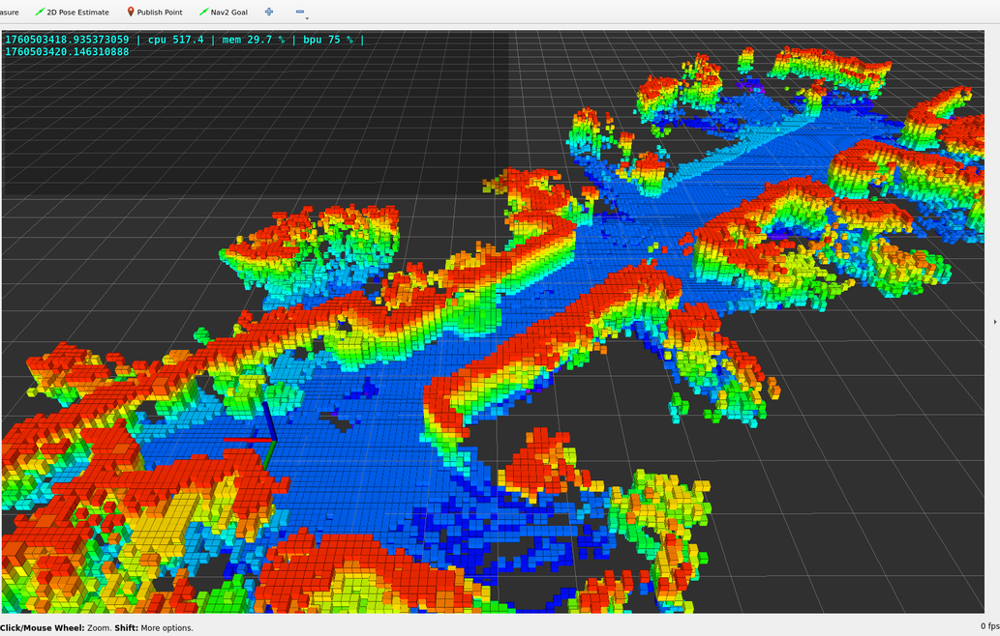 | 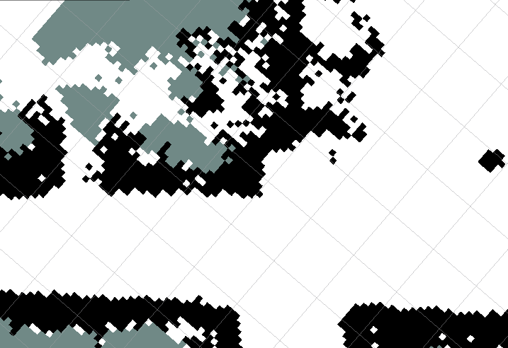 | 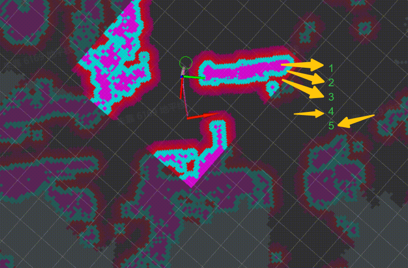 |

导航代价地图中膨胀层的说明参考https://wiki.ros.org/costmap_2d/hydro/inflation
### Q3 地图信息统计
运行如下命令，统计VSLAM算法创建的地图的分辨率，未知、free和障碍物区域面积等信息：

```bash
source /opt/tros/humble/local_setup.bash
source /userdata/vims/install/local_setup.bash
ros2 launch tros_stat_monitor tros_stat_monitor.py
```

终端周期输出如下统计信息：

```bash
[INFO] [1762748921.463344673] [map_area_calculator]: =====================static map info=========================
[INFO] [1762748921.466589630] [map_area_calculator]:     resolution: 0.05 m/cell
[INFO] [1762748921.469902669] [map_area_calculator]: width x height: 447 x 388 cells -> area: 22.35 x 19.40 ㎡
[INFO] [1762748921.473166708] [map_area_calculator]:    total cells: 173436      -> area: 433.59 ㎡
[INFO] [1762748921.477092289] [map_area_calculator]:  unknown cells: 116401      -> area: 291.00 ㎡
[INFO] [1762748921.480386828] [map_area_calculator]:     free cells: 47831       -> area: 119.58 ㎡
[INFO] [1762748921.483860284] [map_area_calculator]: obstacle cells: 9204        -> area: 23.01 ㎡
[INFO] [1762748921.487154782] [map_area_calculator]:     known area: 142.59 ㎡
[INFO] [1762748921.490374780] [map_area_calculator]: =============================================================
```

统计信息中各字段说明如下：

| 字段 | 说明 |
| --- | --- |
| resolution | 栅格（cell）分辨率 |
| width x height | 地图的宽和高 |
| total cells | 地图中总栅格数 |
| unknown cells | 地图中未知区域（不确定有无障碍物）的栅格数 |
| free cells | 地图中free（确定无障碍物）区域栅格数 |
| obstacle cells | 地图中障碍物区域的栅格数 |
| known area | 地图中free和obstacle区域的总面积 |

## 导航
### Q1 导航成功
在RVIZ的Navigation 2 Panel上，Feedback的状态显示reached，表示导航任务成功完成：

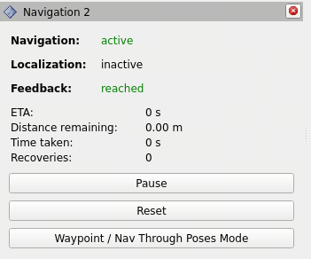

### Q2 导航失败
在RVIZ的Navigation 2 Panel上，Feedback的状态显示aborted，表示导航失败：

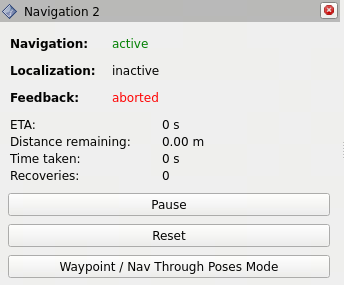

### Q3 导航过程控制
导航过程中，支持取消本次导航，或者设置新的目标位置，以新位置重新导航。
取消本次导航的方法为，在RVIZ的Navigation 2 Panel上，选择Cancel按键（左下图），取消后Feedback的状态显示canceled（右下图）。

| 导航中 | 取消导航后 |
| --- | --- |
| 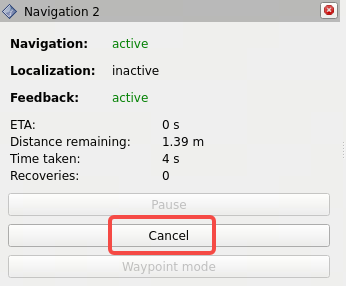 | 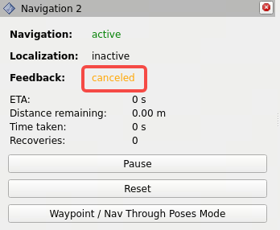 |

### Q4 脱困
当机器人在执行导航任务时，如果路径规划失败，机器人将会进入脱困流程，
在RVIZ的Navigation 2 Panel上，Recoveries状态显示尝试脱困的次数一直在增加，直到脱困成功或者失败。脱困中：

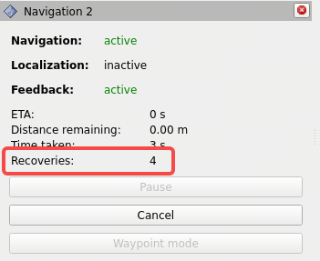

在导航的行为树配置文件中，指定了脱困的流程。在RDK X5上查看行为树配置命令：

```bash
cat `ros2 pkg prefix tros_vision_nav --share`/params/navigate_to_pose_w_replanning_and_recovery.xml
```

行为树节点可视化如下：

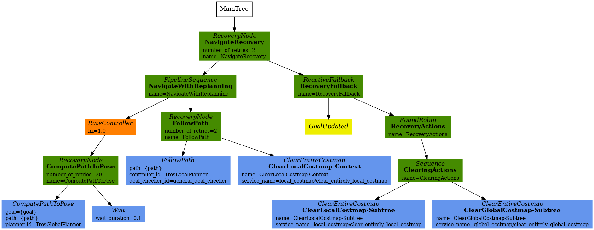

脱困流程：

路径规划（ComputePathToPose）失败时，开始自主探索环境，直到规划成功或者超时（15秒超时）；

如果自主探索环境超时，开始清理地图（ClearingActions），重新生成global/local costmap；

自主探索环境和清理地图两个过程执行3次（NavigateRecovery中的number_of_retries）后，如果仍然路径规划失败，本次导航失败。

因此脱困最长执行时间是45秒（15 x 3）+2次RecoveryFallback，实际约50秒左右。

## 数据录制
### Q1 命令行录制
使用ros2命令行工具在RDK上在线录制bag包，用于数据回放分析问题，支持使用ros2 bag play命令和工具回放。使用命令ros2 bag record -h查看详细数据录制使用方法。
需要录制的基础数据如下：

```bash
ros2 bag record \     /rosout \     /map \     /tros_diagnostics \     /global_costmap/costmap \     /local_costmap/costmap \     /global_costmap/tros_layer_pcl/tros_dynamic_obstacle_costmap \     /local_costmap/tros_layer_pcl/tros_dynamic_obstacle_costmap \     /tros_goal_pose \     /tf \     /tf_static \     /local_costmap/published_footprint \     /object_point_cloud \     /StereoNetNode/stereonet_depth/camera_info \     /global_path \     /plan_smoothed \     /received_global_plan \     /transformed_global_plan \     /local_plan \     /cmd_vel \     /cmd_vel_nav \     /tros_observing_markers \     /tf \     /tf_static \     /image_jpeg
```

如果需要录制深度估计输出的点云，录制时添加/StereoNetNode/stereonet_pointcloud2话题。
### Q2 自动录制
移动solution包含数据trigger & recorder工具，用于路径规划失败时自动触发录制系统状态数据，通过离线回放数据定位问题，支持录制触发前的数据（影子模式）。
工具默认关闭，开启方式为将`ros2 pkg prefix tros_vision_nav --share`/params/tros_nav2.yaml配置文件中enable_record配置项设置为true后，重新启动导航命令。录制的数据保存在运行路径下，路径名为`bag_[planner_server]_[时间戳]`。

```bash
planner_server:
  ros__parameters:
    expected_planner_frequency: 20.0
    use_sim_time: True
    planner_plugins: ["GridBased", "TrosGlobalPlanner"]
    GridBased:
      plugin: "nav2_navfn_planner/NavfnPlanner"
      tolerance: 0.5
      use_astar: true
      allow_unknown: true
    TrosGlobalPlanner:
      plugin: "tros/TrosGlobalPlanner"
      pre_controller: "Exploration"
      primary_controller: "nav2_navfn_planner/NavfnPlanner"
      tolerance: 0.5
      use_astar: false
      allow_unknown: true
      enable_record: false
```

## VSLAM

### 如何测试VSLAM回环

本章节介绍如何可视化机器人的移动轨迹，以及测量回到起点后的定位误差。

***启动VSLAM***

打开RDK X5终端，运行如下命令，包含环境感知，VSLAM，rviz可视化：

```bash
source /opt/tros/humble/local_setup.bash
source /userdata/vims/install/local_setup.bash
mkdir -p /userdata/rtabmap/  
# 删除地图文件
rm /userdata/rtabmap/office.db 
YAML_CONFIG_FILE=`ros2 pkg prefix tros_vision_nav --share`/params/params.yaml \ run_explore=False run_traj_viz=True run_nav=False bash `ros2 pkg prefix tros_vision_nav --share`/launch/run_launch.sh
```

***配置RVIZ***

RVIZ上，将坐标系设置为map，勾选MapStatic（2D地图），traj_map（移动轨迹）和traj_starter_map（轨迹起点）。如果需要查看3D地图，勾选ColorOccupancyGrid。

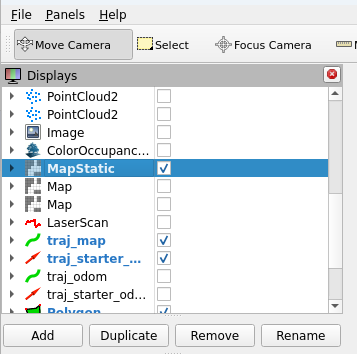


> **提示** 建图过程中，建议关闭3D地图渲染，以免影响建图质量，建好图后再打开3D地图渲染。
>

***启动键盘控制***

打开RDK X5终端，运行如下命令，启动键盘控制功能包，用于使用键盘控制机器人移动：

```bash
source /opt/tros/humble/local_setup.bash
ros2 run teleop_twist_keyboard teleop_twist_keyboard
```

**测试**

使用键盘控制机器人移动，移动过程中（左下图），rviz上会渲染起点、运行轨迹、轨迹信息。最终机器人回到起点后（右下图），可以看到机器人当前pose和起始pose之间的距离偏差，即回环偏差。从右下图可以看到，机器人移动了26米，耗时6分25秒，回环偏差0.02米。

| 移动过程中 | 回到起点后 |
| --- | --- |
| 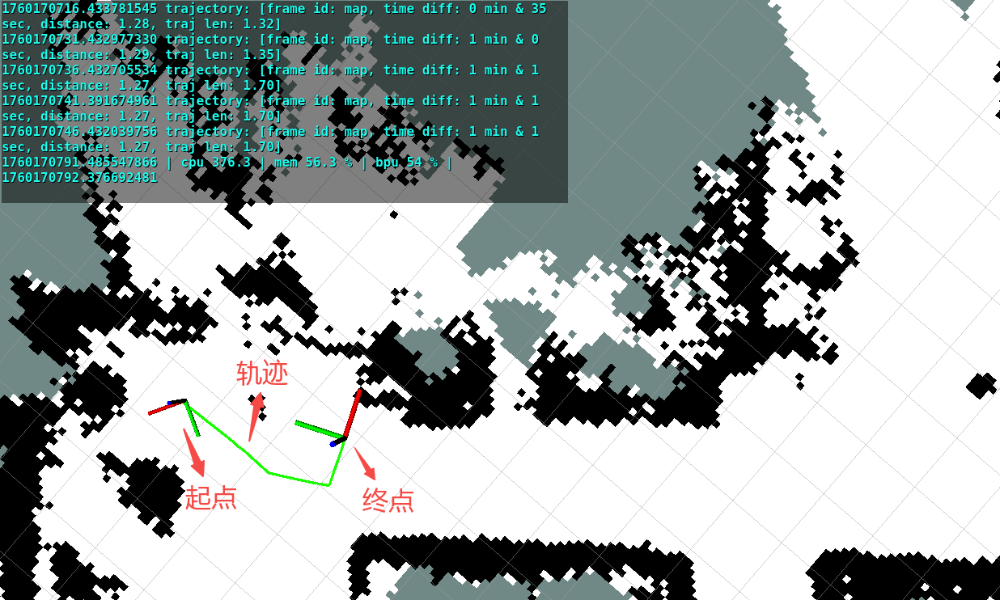 | 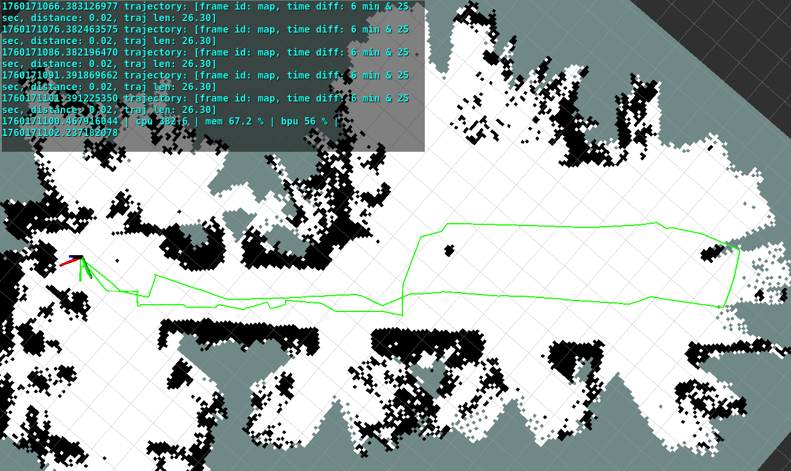 |

渲染的轨迹信息说明：

| 信息 | 说明 |
| --- | --- |
| frame id | 轨迹坐标系 |
| time diff | 机器人从移动开始到结束的时间 |
| distance | 机器人当前pose和起始pose之间的距离偏差，即回环偏差 |
| traj len | 机器人从移动开始到结束的轨迹总长度 |


## 自主探索建图
### Q1 自主探索建图过程

step1: 观测周围环境。启动自主探索后，先旋转一周观测周围环境。

step2: 搜索地图边界。使用边界搜索算法从global costmap中识别出地图中的边界。如下图黄色点为costmap边界的栅格（cell）。

step3: 计算待探索点。对于每个边界区域，计算出其中心点（如下图红色方格），作为待探索点，即导航目标点（goal pose），优先探索最近的边界区域。

step4:  开始探索。使用导航算法控制机器人到达goal pose。如下图是探索过程中，rviz上渲染了规划出来的路径，Exploration Panel的Exploration状态显示为“Exploring frontier 1/8”表示总共有8个待探索区域，当前正在探索第1个区域。

step5: 探索完成。完成探索后，机器人停止。

探索建图中：

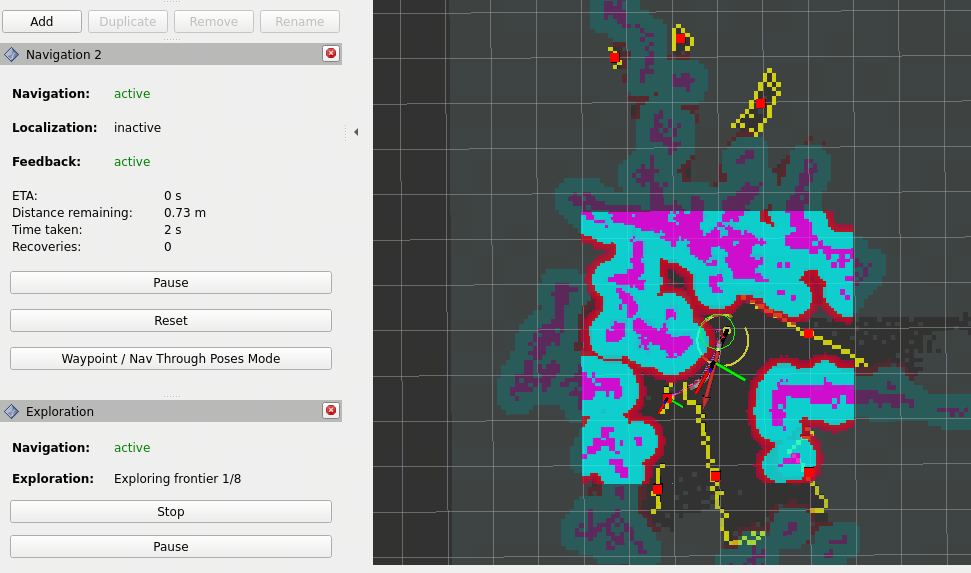

### Q2 建图区域

如果发现生成的地图不完整，或者需要对更大区域进行建图，请尝试增加探索半径阈值frontier_search_radius和路径规划长度阈值frontier_goal_nav_path_dist（默认值的查看方法为：使用命令 vi `ros2 pkg prefix tros_vision_nav --share`/params/params.yaml 打开配置后，搜索参数关键字）。

这两个参数说明如果待探索区域和机器人当前位置的距离超过frontier_search_radius米，或者规划出来的路径长度超过frontier_goal_nav_path_dist米，忽略探索这块区域。

例如启动时将frontier_search_radius设置为25.0，frontier_goal_nav_path_dist设置为50.0的命令如下：

```bash
source /opt/tros/humble/local_setup.bash
source /userdata/vims/install/local_setup.bash
cp -r `ros2 pkg prefix dnn_node_example`/lib/dnn_node_example/config . 
YAML_CONFIG_FILE=`ros2 pkg prefix tros_vision_nav --share`/params/params.yaml \ frontier_search_radius=25.0 frontier_goal_nav_path_dist=50.0 bash `ros2 pkg prefix tros_vision_nav --share`/launch/run_launch.sh
```

### Q3 参数说明
自主探索建图涉及到的参数详细说明：

| 参数名 | 含义 | 取值 | 默认值 |
| --- | --- | --- | --- |
| min_frontier_size | 最小边界尺寸阈值，只探索超过阈值的边界 | > 0 | 0.2 |
| return_to_init | 探索完成后是否回到起点 | true/false | false |
| retry_limit | 探索完成后再次重新探索的次数 | >= 0 | 1 |
| nav_timeout_seconds | 一次导航的时间限制，超过限制将会取消本次导航 | >= 0 | 300 |
| frontier_search_radius | 探索半径阈值，只探索和机器人当前位置的距离小于阈值的边界 | > 0 | 8.0 |
| frontier_goal_nav_path_dist | 路径规划长度阈值，如果到导航目标点的路径长度超过阈值，取消本次导航 | > 0 | 10.0 |
| move_time_allowance | 移动超时时间，如果在超时时间内移动距离小于move_radius，取消本次导航 | > 0 | 10.0 |
| move_radius | 移动超时距离 | > 0 | 0.2 |

## 单模块运行命令
### 1. 运行时指定配置文件

```bash
# 默认使用的配置文件为`ros2 pkg prefix tros_vision_nav --share`/params/params.yaml
# 支持启动时用户使用YAML_CONFIG_FILE环境变量指定配置文件
YAML_CONFIG_FILE=/userdata/params.yaml bash `ros2 pkg prefix tros_vision_nav --share`/launch/run_launch.sh
```

### 2. 只启动rviz

```bash
ros2 run rviz2 rviz2 -d `ros2 pkg prefix tros_vision_nav`/share/tros_vision_nav/params/nav.rviz
```

### 3. 只启动导航

```bash
YAML_CONFIG_FILE=`ros2 pkg prefix tros_vision_nav --share`/params/params.yaml \ localization=True log_level_nav=info LAUNCH_FILE="nav.launch.py" bash `ros2 pkg prefix tros_vision_nav --share`/launch/run_launch.sh
```

### 4. 只启动自主探索

```bash
YAML_CONFIG_FILE=`ros2 pkg prefix tros_vision_nav --share`/params/params.yaml LAUNCH_PACKAGE=tros_frontier_exploration LAUNCH_FILE="explore.launch.py" bash `ros2 pkg prefix tros_vision_nav --share`/launch/run_launch.sh
```

### 5. 只启动底盘和双目深度估计

```bash
stereonet_pub_web=True run_pcl2grid=False run_rviz=False run_perc=False run_slam=False run_nav=False run_explore=False run_mask_depth=False mipi_image_framerate=20.0 bash `ros2 pkg prefix tros_vision_nav --share`/launch/run_launch.sh
```

### 6. 只启动通用障碍物识别

```bash
YAML_CONFIG_FILE=`ros2 pkg prefix tros_vision_nav --share`/params/params.yaml LAUNCH_FILE="pcl_obstacle_det.launch.py" use_composition=False bash `ros2 pkg prefix tros_vision_nav --share`/launch/run_launch.sh
```
