# [FAQ](https://github.com/D-Robotics/tros_vims_doc.git)

## 1. 常用模式配置

### 1.1 选择底盘

修改配置文件中robot的参数，设置底盘类型（originbot/myrobot/create3），其中`myrobot`表示自定义底盘，需要根据实际情况修改。

```bash
# 打开配置文件 
vi `ros2 pkg prefix tros_vision_nav --share`/params/params.yaml 
# 将"robot_base"参数设置为 originbot/myrobot/create3
```

### 1.2 选择相机参数

修改配置文件中camera参数组中的mipi_rotation配置项，根据相机类型设置旋转角度：

```bash
# 打开配置文件
vi `ros2 pkg prefix tros_vision_nav --share`/params/params.yaml
# 设置mipi_rotation为90.0/0.0
```

> **注意** 
1. 70mm基线（带IMU）不需要设置图像旋转，即启动时指定mipi_rotation=0.0。 
2. 80mm以及其他基线（不带IMU）需要设置图像旋转，即启动时指定mipi_rotation=90.0。
>

### 1.3 选择里程计
修改配置文件中switch参数组中的odom_type配置项，选择里程计来源：

```bash
# 打开配置文件
vi `ros2 pkg prefix tros_vision_nav --share`/params/params.yaml
# 设置odom_type为wheel/vio
```

配置说明：
wheel 表示轮式里程计。
vio 表示视觉里程计

> **注意** 只有70mm基线（带IMU）相机支持vio。
>

### 1.4 选择运动类型

SLAM建图默认采用的机器人运动类型为2D平面移动，如果机器人为3D运动（机器人运动过程中存在roll/pitch/z轴高度的变化），需要将SLAM建图设置为支持3D运动模式。
修改配置文件中rtabmap参数组中的rtabmap_Reg_Force3DoF（设置为False）和rtabmap_Mem_UseOdomGravity（设置为True）配置项，打开支持3D运动模式：

```bash
# 打开配置文件
vi `ros2 pkg prefix tros_vision_nav --share`/params/params.yaml
# 设置  rtabmap_Reg_Force3DoF: "'False'"
# True=3DoF(xy+yaw), False=6DoF
# 设置  rtabmap_Mem_UseOdomGravity: "'True'"
# True=use VIO orientation as gravity ref
```

> **注意** 只有当里程计类型为vio时，才SLAM建图才支持3D运动模式。如果里程计类型为wheel，禁止打开SLAM建图的3D运动模式。 只有70mm基线（带IMU）相机支持vio。
>

## 2. 使用OriginBot轮式里程计

地瓜机器人对OriginBot的MCU程序进行了重构和优化，包括数据采集频率、轮速采集计算周期、硬件同步数据触发、时间同步等功能，使最终EKF融合出的odom更准。

如使用OriginBot轮式里程计，请确保下载和烧写本章节提供的固件。
1. [下载固件](https://archive.d-robotics.cc/TogetheROS/files/vision_mobile_solution/originbot/mcu/OriginBot_Firmware_dbb59.hex)
2. [烧写固件](https://www.originbot.org/guide/firmware_install.html)。


## 3. 双目相机和深度估计
双目相机相关问题参考[双目MIPI图像采集](https://developer.d-robotics.cc/tros_doc/quick_demo/demo_sensor#%E5%8F%8C%E7%9B%AEmipi%E5%9B%BE%E5%83%8F%E9%87%87%E9%9B%86)。
深度估计相关问题参考[双目深度算法](https://developer.d-robotics.cc/tros_doc/boxs/spatial/hobot_stereonet)。

## 4. 地图
### 4.1 重新建图
SLAM创建的地图保存在RDK X5上的文件名为/userdata/rtabmap/office.db，如果需要删除地图并重新创建地图，先停止SLAM程序，然后执行rm /userdata/rtabmap/office.db命令后重新运行SLAM。

### 4.2 地图说明

SLAM 3D地图：蓝色区域表示低矮障碍物区域（地面也属于这一类）；蓝色以上从绿色到红色，表示障碍物高度依次增加（限制了地图中的障碍物高度小于0.5米）；黑色区域表示未知区域。

SALM 2D地图：白色区域表示无障碍物，黑色区域表示障碍物区域；灰色区域表示未知区域。

导航地图：高亮区域表示局部代价地图（local costmap，箭头1、2、3所在区域）；低亮区域表示全局代价地图（global costmap，箭头5所在区域）；1表示实际障碍物区域；2和3表示膨胀层；4表示无障碍物；5表示全局代价地图的障碍物层和膨胀层。

SLAM 3D地图和2D地图之间的关系：3D地图通过卡高度阈值去除地面，Z轴（地面高度方向，对应右手坐标系的Z轴）投影到地面后得到2D地图，用于下游的导航和避障任务。

导航代价地图和SLAM 2D地图之间的关系：SLAM 2D地图作为导航代价地图中的静态障碍物层，同时叠加障碍物识别算法提取的低矮障碍物，最终的到用于导航和避障的导航代价地图。

| SALM 3D地图 | SALM 2D地图 | 导航代价地图 |
| :---: | :---: | :---: |
| 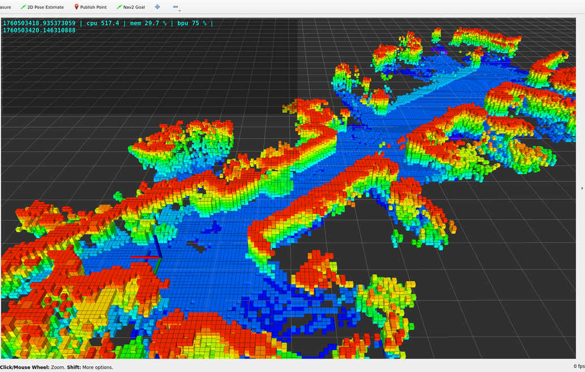 | 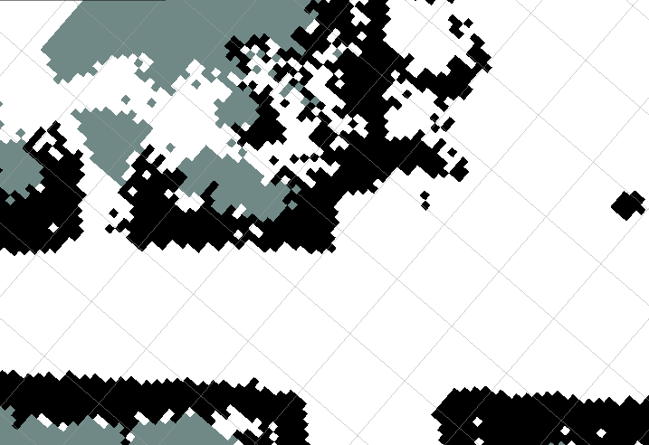 | 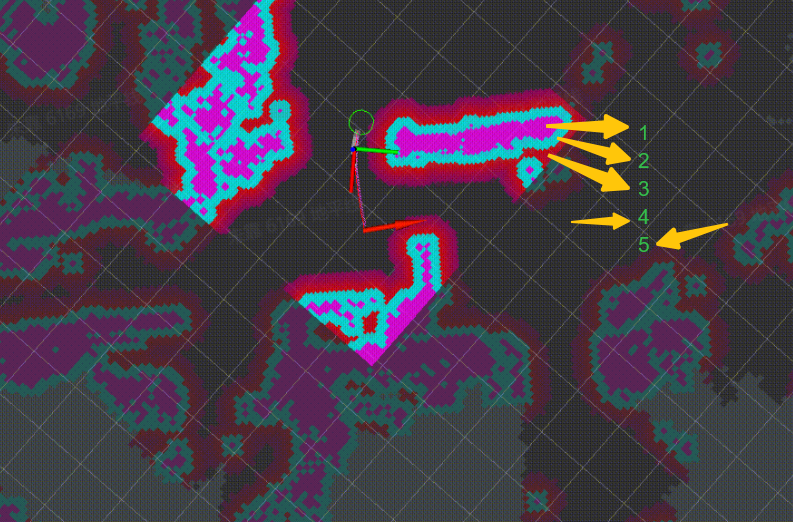 |

导航代价地图中膨胀层的说明参考https://wiki.ros.org/costmap_2d/hydro/inflation
### 4.3 地图信息统计
运行如下命令，统计VSLAM算法创建的地图的分辨率，未知、free和障碍物区域面积等信息：

```bash
source /opt/tros/humble/local_setup.bash
source /userdata/vims/install/local_setup.bash
ros2 launch tros_stat_monitor tros_stat_monitor.py
```

终端周期输出如下统计信息：

```bash
[INFO] [1762748921.463344673] [map_area_calculator]: =====================static map info=========================
[INFO] [1762748921.466589630] [map_area_calculator]:     resolution: 0.05 m/cell
[INFO] [1762748921.469902669] [map_area_calculator]: width x height: 447 x 388 cells -> area: 22.35 x 19.40 ㎡
[INFO] [1762748921.473166708] [map_area_calculator]:    total cells: 173436      -> area: 433.59 ㎡
[INFO] [1762748921.477092289] [map_area_calculator]:  unknown cells: 116401      -> area: 291.00 ㎡
[INFO] [1762748921.480386828] [map_area_calculator]:     free cells: 47831       -> area: 119.58 ㎡
[INFO] [1762748921.483860284] [map_area_calculator]: obstacle cells: 9204        -> area: 23.01 ㎡
[INFO] [1762748921.487154782] [map_area_calculator]:     known area: 142.59 ㎡
[INFO] [1762748921.490374780] [map_area_calculator]: =============================================================
```

统计信息中各字段说明如下：

| 字段 | 说明 |
| :---: | :---: |
| resolution | 栅格（cell）分辨率 |
| width x height | 地图的宽和高 |
| total cells | 地图中总栅格数 |
| unknown cells | 地图中未知区域（不确定有无障碍物）的栅格数 |
| free cells | 地图中free（确定无障碍物）区域栅格数 |
| obstacle cells | 地图中障碍物区域的栅格数 |
| known area | 地图中free和obstacle区域的总面积 |

## 5. 导航
### 5.1 导航成功
在RVIZ的Navigation 2 Panel上，Feedback的状态显示reached，表示导航任务成功完成：

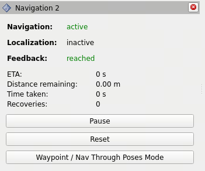

### 5.2 导航失败
在RVIZ的Navigation 2 Panel上，Feedback的状态显示aborted，表示导航失败：

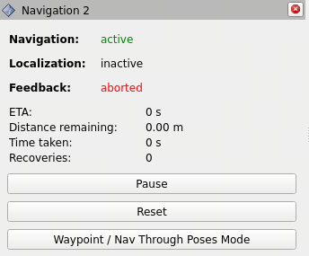

### 5.3 导航过程控制
导航过程中，支持取消本次导航，或者设置新的目标位置，以新位置重新导航。
取消本次导航的方法为，在RVIZ的Navigation 2 Panel上，选择Cancel按键（左下图），取消后Feedback的状态显示canceled（右下图）。

| 导航中 | 取消导航后 |
| :---: | :---: |
| 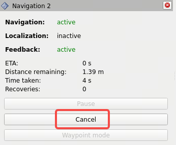 | 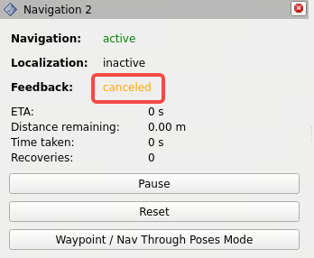 |

### 5.4 脱困
当机器人在执行导航任务时，如果路径规划失败，机器人将会进入脱困流程，
在RVIZ的Navigation 2 Panel上，Recoveries状态显示尝试脱困的次数一直在增加，直到脱困成功或者失败。脱困中：

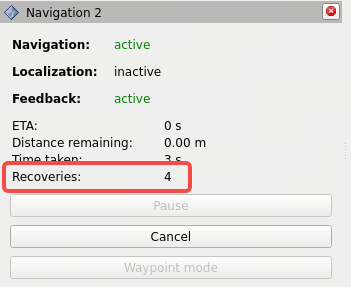

在导航的行为树配置文件中，指定了脱困的流程。在RDK X5上查看行为树配置命令：

```bash
cat `ros2 pkg prefix tros_vision_nav --share`/params/navigate_to_pose_w_replanning_and_recovery.xml
```

行为树节点可视化如下：

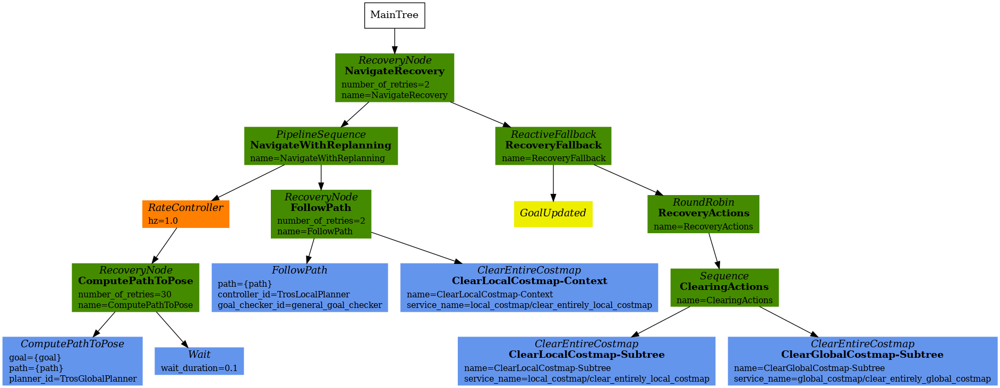

脱困流程：

路径规划（ComputePathToPose）失败时，开始自主探索环境，直到规划成功或者超时（15秒超时）；

如果自主探索环境超时，开始清理地图（ClearingActions），重新生成global/local costmap；

自主探索环境和清理地图两个过程执行3次（NavigateRecovery中的number_of_retries）后，如果仍然路径规划失败，本次导航失败。

因此脱困最长执行时间是45秒（15 x 3）+2次RecoveryFallback，实际约50秒左右。

## 6. 数据录制
### 6.1 命令行录制
使用ros2命令行工具在RDK上在线录制bag包，用于数据回放分析问题，支持使用ros2 bag play命令和工具回放。使用命令ros2 bag record -h查看详细数据录制使用方法。
需要录制的基础数据如下：

```bash
ros2 bag record /rosout /map /tros_diagnostics /global_costmap/costmap /local_costmap/costmap \
/global_costmap/tros_layer_pcl/tros_dynamic_obstacle_costmap /local_costmap/tros_layer_pcl \
/tros_dynamic_obstacle_costmap /tros_goal_pose /tf /tf_static /local_costmap/published_footprint \
/object_point_cloud /StereoNetNode/stereonet_depth/camera_info /global_path /plan_smoothed \
/received_global_plan /transformed_global_plan /local_plan /cmd_vel /cmd_vel_nav \
/tros_observing_markers /tf /tf_static /image_jpeg
```

如果需要录制深度估计输出的点云，录制时添加/StereoNetNode/stereonet_pointcloud2话题。
### 6.2 自动录制
移动solution包含数据trigger & recorder工具，用于路径规划失败时自动触发录制系统状态数据，通过离线回放数据定位问题，支持录制触发前的数据（影子模式）。
工具默认关闭，开启方式为将`ros2 pkg prefix tros_vision_nav --share`/params/tros_nav2.yaml配置文件中enable_record配置项设置为true后，重新启动导航命令。录制的数据保存在运行路径下，路径名为`bag_[planner_server]_[时间戳]`。

```bash
planner_server:
  ros__parameters:
    expected_planner_frequency: 20.0
    use_sim_time: True
    planner_plugins: ["GridBased", "TrosGlobalPlanner"]
    GridBased:
      plugin: "nav2_navfn_planner/NavfnPlanner"
      tolerance: 0.5
      use_astar: true
      allow_unknown: true
    TrosGlobalPlanner:
      plugin: "tros/TrosGlobalPlanner"
      pre_controller: "Exploration"
      primary_controller: "nav2_navfn_planner/NavfnPlanner"
      tolerance: 0.5
      use_astar: false
      allow_unknown: true
      enable_record: false
```

## 7. VSLAM

### 7.1 如何测试VSLAM回环

本章节介绍如何可视化机器人的移动轨迹，以及测量回到起点后的定位误差。

***启动VSLAM***

打开RDK X5终端，运行如下命令，包含环境感知，VSLAM，rviz可视化：

```bash
source /opt/tros/humble/local_setup.bash
source /userdata/vims/install/local_setup.bash
mkdir -p /userdata/rtabmap/  
# 删除地图文件
rm /userdata/rtabmap/office.db 
YAML_CONFIG_FILE=`ros2 pkg prefix tros_vision_nav --share`/params/params.yaml \
run_explore=False run_traj_viz=True run_nav=False \
bash `ros2 pkg prefix tros_vision_nav --share`/launch/run_launch.sh
```

***配置RVIZ***

RVIZ上，将坐标系设置为map，勾选MapStatic（2D地图），traj_map（移动轨迹）和traj_starter_map（轨迹起点）。如果需要查看3D地图，勾选ColorOccupancyGrid。

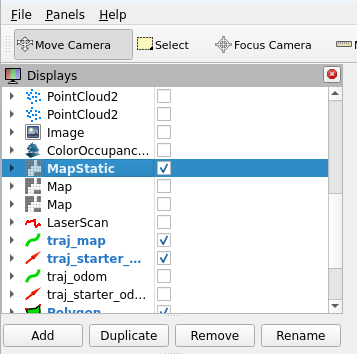


> **提示** 建图过程中，建议关闭3D地图渲染，以免影响建图质量，建好图后再打开3D地图渲染。
>

***启动键盘控制***

打开RDK X5终端，运行如下命令，启动键盘控制功能包，用于使用键盘控制机器人移动：

```bash
source /opt/tros/humble/local_setup.bash
ros2 run teleop_twist_keyboard teleop_twist_keyboard
```

**测试**

使用键盘控制机器人移动，移动过程中（左下图），rviz上会渲染起点、运行轨迹、轨迹信息。最终机器人回到起点后（右下图），可以看到机器人当前pose和起始pose之间的距离偏差，即回环偏差。从右下图可以看到，机器人移动了26米，耗时6分25秒，回环偏差0.02米。

| 移动过程中 | 回到起点后 |
| :---: | :---: |
| 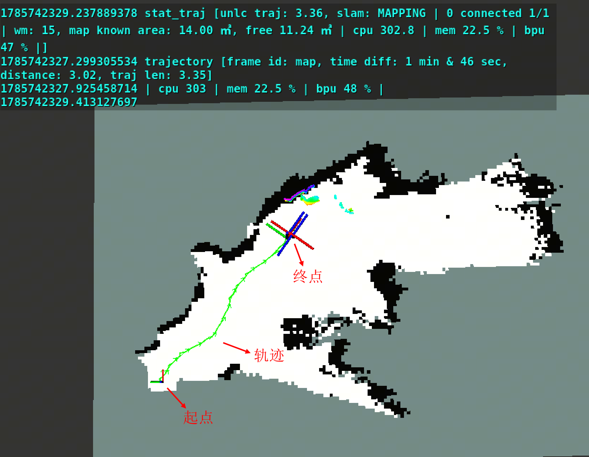 | 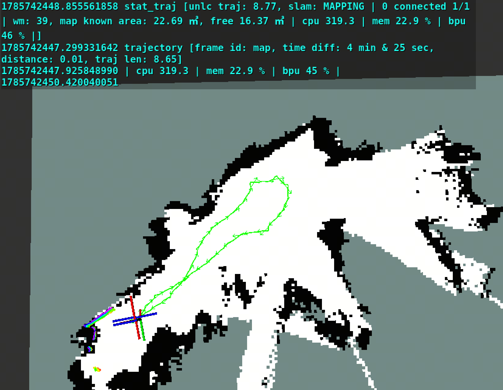 |

渲染的轨迹信息说明：

| 信息 | 说明 |
| :---: | :---: |
| frame id | 轨迹坐标系 |
| time diff | 机器人从移动开始到结束的时间 |
| distance | 机器人当前pose和起始pose之间的距离偏差，即回环偏差 |
| traj len | 机器人从移动开始到结束的轨迹总长度 |


## 8. 自主探索建图
### 8.1 自主探索建图过程

step1: 观测周围环境。启动自主探索后，先旋转一周观测周围环境。

step2: 搜索地图边界。使用边界搜索算法从global costmap中识别出地图中的边界。如下图黄色点为costmap边界的栅格（cell）。

step3: 计算待探索点。对于每个边界区域，计算出其中心点（如下图红色方格），作为待探索点，即导航目标点（goal pose），优先探索最近的边界区域。

step4:  开始探索。使用导航算法控制机器人到达goal pose。如下图是探索过程中，rviz上渲染了规划出来的路径，Exploration Panel的Exploration状态显示为“Exploring frontier 1/8”表示总共有8个待探索区域，当前正在探索第1个区域。

step5: 探索完成。完成探索后，机器人停止。

探索建图中：

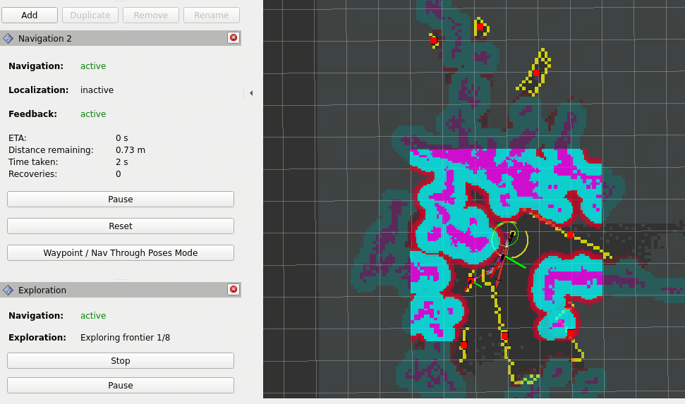

### 8.2 建图区域

如果发现生成的地图不完整，或者需要对更大区域进行建图，请尝试增加探索半径阈值frontier_search_radius和路径规划长度阈值frontier_goal_nav_path_dist（默认值的查看方法为：使用命令 vi `ros2 pkg prefix tros_vision_nav --share`/params/params.yaml 打开配置后，搜索参数关键字）。

这两个参数说明如果待探索区域和机器人当前位置的距离超过frontier_search_radius米，或者规划出来的路径长度超过frontier_goal_nav_path_dist米，忽略探索这块区域。

例如启动时将frontier_search_radius设置为25.0，frontier_goal_nav_path_dist设置为50.0的命令如下：

```bash
source /opt/tros/humble/local_setup.bash
source /userdata/vims/install/local_setup.bash
cp -r `ros2 pkg prefix dnn_node_example`/lib/dnn_node_example/config . 

YAML_CONFIG_FILE=`ros2 pkg prefix tros_vision_nav --share`/params/params.yaml \
frontier_search_radius=25.0 frontier_goal_nav_path_dist=50.0 \
bash `ros2 pkg prefix tros_vision_nav --share`/launch/run_launch.sh
```

### 8.3 参数说明
自主探索建图涉及到的参数详细说明：

| 参数名 | 含义 | 取值 | 默认值 |
| :---: | :---: | :---: | :---: |
| min_frontier_size | 最小边界尺寸阈值，只探索超过阈值的边界 | > 0 | 0.2 |
| return_to_init | 探索完成后是否回到起点 | true/false | false |
| retry_limit | 探索完成后再次重新探索的次数 | >= 0 | 1 |
| nav_timeout_seconds | 一次导航的时间限制，超过限制将会取消本次导航 | >= 0 | 300 |
| frontier_search_radius | 探索半径阈值，只探索和机器人当前位置的距离小于阈值的边界 | > 0 | 8.0 |
| frontier_goal_nav_path_dist | 路径规划长度阈值，如果到导航目标点的路径长度超过阈值，取消本次导航 | > 0 | 10.0 |
| move_time_allowance | 移动超时时间，如果在超时时间内移动距离小于move_radius，取消本次导航 | > 0 | 10.0 |
| move_radius | 移动超时距离 | > 0 | 0.2 |

## 9. SLAM 模式与子图管理说明

**SLAM 模式与子图管理**是探索节点内置的长时 SLAM 自维护机制：在无人干预下自动在"建图/定位"两种模式间切换、自动新建与删除子图，控制长期运行中的关键帧冗余与子图膨胀。它解决的是机器人长期使用后地图越用越歪、定位越来越漂、冗余子图越积越多导致导航跑偏的问题；通过"熟悉区域转定位避免关键帧冗余、陌生区域转建图补覆盖、低价值子图自动清理"的自动调度，让机器人用得越久越熟悉环境，保持稳定可靠的陪伴导航体验，全程无需用户干预。

### 9.1 这些功能解决什么问题

长期探索过程中，视觉 SLAM 会面临两类不可避免的退化：

- **累积漂移**：随着探索范围扩大、轨迹长时间不闭合，位姿误差持续累积，地图逐渐"扭曲"。
- **子图膨胀 / 冗余**：SLAM 会不断切分新的子图（submap），其中部分子图可能规模过小、与主图断连，或因优化异常而质量下降，拖累整体定位与地图质量。

探索节点内置的 **SLAM 模式自动切换** 与 **子图自动管理** 即用于在无人干预的情况下抑制这两类退化，保持长时探索的地图与定位稳定性。

> 以上两类自动行为都受同一总开关 `explore_en_longterm_update_map`（默认开启）控制；关闭后下述所有自动行为均不生效，退化到传统的先建图再定位的使用模式。

### 9.2 SLAM 模式自动切换

SLAM 有两种工作模式：

| 模式 | 作用 |
|------|------|
| **建图（MAPPING）** | 持续向地图中新增观测，扩展覆盖范围 |
| **定位（LOCALIZATION）** | 在已有地图上仅做定位，不再新增关键帧、不再扩展地图，避免关键帧冗余、降低内存占用 |

探索期间模式切换是**全自动**的，用户无需手动干预，核心规则如下：

#### 9.2.1 定位 → 建图

触发条件有以下几类（共 7 个触发点），任一满足即切回建图：

| # | 触发场景 | 涉及参数（默认值） | 说明 |
|---|----------|-------------------|------|
| 1 | 关键帧过稀 / 子图未连通 | `explore_check_kf_radius`（**0.5 m**）内关键帧数 < `explore_kf_check_num_thr`（**4**），连续 `explore_check_kf_count_thr`（**2**）次确认；或 `cached_all_maps_connected_ == false` | 机器人当前位置关键帧密度过稀，或子图未全连通时，切回建图补齐观测 |
| 2 | 工作内存关键帧过少 | `wm_state` 关键帧数 < `relocating_min_keyframes_thr`（**10**） | SLAM 工作内存层面的关键帧不足（与 #1 的"位置附近关键帧密度"是不同维度） |
| 3 | 无地图 / 子图丢失 | `current_map_id < 0` 且 `connected_map_component_values` 为空 | 当前没有可用地图，切回建图并原地旋转补图 |
| 4 | 未闭环轨迹过长 / 累积误差 | 未闭环轨迹长度 ≥ `search_loop_closure_thr`（**5.0**）× `unlc_traj_high_scale`（**4.0**）= 20 | 累积误差有放大风险，切回建图重置误差起点 |
| 5 | 重定位失败或超时 | 重定位失败，或耗时超过 `relocating_timeout`（**30.0 s**） | 定位模式下重定位失败意味着现有地图无法匹配当前观测，切回建图重建 |
| 6 | 重定位慢成功补建图 | 重定位成功但耗时 ≥ `relocating_warn_time_thr`（**10.0 s**） | 定位不够稳，切回建图并导航到缓存位姿补建图 |
| 7 | 当前子图优化误差过大 | 优化误差比 > `slam_opt_error_thr`（**3.0**）立即删，或在 warn band（> `slam_opt_warn_thr`（**1.5**））连续累计 ≥ `delete_cur_map_opt_warn_count_thr`（**5**）次删 | 删除当前子图前会先切回建图重建该区域（详见 9.4.2「删除子图」） |

> **与"建图→定位"的区别**：这 7 个触发点是**任一满足即切换**（OR 关系），而"建图→定位"的 11 个条件需**全部满足**（AND 关系）。因此"定位→建图"更容易触发——只要任一异常出现就切回建图补齐，这是保守策略（宁可多建图也不要漂移）。
>
> **触发后的共同行为**：切回建图后会刷新 `mapping_start_time_`（重置"建图→定位"的计时器），即每次切回建图后要重新累计 `auto_localize_mapping_duration_thr`（180s）才可能再切定位。

#### 9.2.2 建图 → 定位

当满足"已建图足够久、地图面积足够大、当前位置与目标点附近关键帧密度达标、子图已连通"等条件时，自动切回定位模式以避免在已熟悉区域继续新增关键帧造成冗余、降低内存占用。具体需**同时满足以下 11 个条件**（缺一不可，任一不满足则**不切换**，部分条件不满足还会**重置建图计时器**导致"一直切不回定位"）：

| # | 条件 | 涉及参数（默认值） | 不满足时的处理 |
|---|------|-------------------|----------------|
| 1 | 当前处于建图模式 | `current_slam_mode_ == MAPPING` | 非 MAPPING 不触发 |
| 2 | 进入建图已持续超过时长阈值 | `auto_localize_mapping_duration_thr`（**180.0 s**） | 未超时则不切换 |
| 3 | 代价地图物理面积 ≥ 阈值 | `auto_localize_map_area_thr`（**50.0 m²**，面积 = `getSizeInMetersX() × getSizeInMetersY()`） | 面积不够则不切换 |
| 4 | 当前子图 id 有效 | `cached_current_map_id_ >= 0` | 无有效子图则不切换 |
| 5 | 所有子图已全连通 | `cached_all_maps_connected_ == true` | 有子图断连则不切换（会先触发"定位→建图"去补连通） |
| 6 | 当前位置半径内关键帧数达标 | `explore_check_kf_radius`（**0.5 m**）内关键帧数 ≥ `explore_kf_check_num_thr + 2`（**4+2=6**） | **不满足会重置 `mapping_start_time_ = now()`**，计时器归零，永远切不了 |
| 7 | 导航 goal 附近关键帧数达标 | goal 位置 `explore_check_kf_radius`（**0.5 m**）内关键帧数 ≥ `explore_kf_check_num_thr + 1`（**4+1=5**） | **同样重置 `mapping_start_time_`** |
| 8 | 不在重定位中 | `state_ != RELOCATING` | 重定位期间不切换 |
| 9 | 不在回环检测中 | `state_ != LOOPCLOSING` | 回环期间不切换 |
| 10 | 无进行中的模式切换请求 | `pending_slam_mode_ == UNKNOWN` | 有 pending 请求则不切换 |
| 11 | 长期地图管理总开关开启 | `explore_en_longterm_update_map`（**true**） | 关闭则全部自动切换不生效 |

> **最容易卡住的点**：条件 6/7（关键帧密度）。若机器人长期停留在关键帧稀疏区域，这两条会反复**重置 `mapping_start_time_`**，使条件 2 的"建图已持续 180s"永远从头算起，导致一直停在 MAPPING 切不回定位。排查见 9.5.3「什么时候该留心」。
>
> **`mapping_start_time_` 的额外重置点**：从回环/重定位退出进入其它状态时，若当前在建图，也会重置 `mapping_start_time_`——即"建图→定位"的计时从上一次回环/重定位结束时刻起算。

> 对用户的含义：探索过程中 SLAM 会在建图与定位之间自动往返，这是正常且期望的行为，不需要手动切换。

相关可调参数：

| 参数 | 默认 | 调参作用 |
|------|------|----------|
| `explore_en_longterm_update_map` | true | 总开关。关闭则禁用全部自动模式切换与子图管理 |
| `auto_localize_mapping_duration_thr` | 180.0 | 建图多久后**允许**自动切定位（秒）。增大→更长时间停留在建图、地图更完整但关键帧更冗余；减小→更早切定位、关键帧不冗余但地图扩展更慢 |
| `auto_localize_map_area_thr` | 50.0 | 地图面积下限（m²），低于此值不切定位。场地较小可下调，避免一直达不到阈值而无法切定位 |
| `explore_check_kf_radius` | 0.5 | 关键帧密度检测半径（m） |
| `explore_kf_check_num_thr` | 4 | 半径内关键帧数低于此值判定为"过稀"，触发切回建图 |
| `explore_check_kf_count_thr` | 2 | 连续多少次判定过稀才真正触发切回建图，避免偶发稀疏误触发 |
| `relocating_timeout` | 30.0 | 重定位总超时（秒）。超时未完成重定位会判定为失败，触发"定位→建图"切回建图重建 |
| `relocating_min_keyframes_thr` | 10 | 工作内存关键帧数下限，低于此值触发"定位→建图"；重定位过程中低于此值会中止重定位 |
| `relocating_warn_time_thr` | 10.0 | 重定位慢成功阈值（秒）。重定位成功但耗时超过此值会触发"定位→建图"补建图 |
| `search_loop_closure_thr` | 5.0 | 未闭环轨迹长度基础阈值。定位模式下轨迹超过 `阈值 × unlc_traj_high_scale` 触发"定位→建图"重置误差 |
| `unlc_traj_high_scale` | 4.0 | 未闭环轨迹长度的高档倍数。轨迹达 `search_loop_closure_thr × 该倍数` 时切回建图 |

### 9.3 模式稳定条件与稳态

SLAM 模式是否"稳定"（长时间停留在某一模式而不频繁切换），取决于环境熟悉度与所处阶段：

| 阶段 / 环境状态 | 模式表现 | 稳定状态 |
|------|------|------|
| 环境已充分探索、机器人活动在已建图区域 | "地图足够大、子图已连通、当前位置与目标点附近关键帧密度充足、建图已持续足够久"等条件持续满足，自动切到定位并长期停留 | **稳定在定位（LOCALIZATION）** |
| 正在探索新区域 / 关键帧密度时稀时密 / 子图尚未连通 | 关键帧过稀或子图未连通时切回建图，补齐后再尝试切定位，来回切换 | 不稳定，在建图与定位间往返 |
| 地图面积或建图时长始终达不到阈值，或关键帧长期过稀 | 无法满足切定位条件，持续建图 | **稳定在建图（MAPPING）**（持续建图、尚未收敛到定位稳态） |

**通常的稳态是定位模式**：当家庭环境已被充分探索后，机器人大部分时间稳定在定位模式——地图不再显著增长，定位精度稳定，仅偶尔进入陌生或关键帧稀疏区域时短暂切回建图补齐观测，随后自动恢复定位。这是长时运行期望达到的状态。

**探索期不稳定是正常的**：首次建图与探索新区域阶段，模式会在建图与定位间往返，这是覆盖新区域、又在已覆盖区域避免关键帧冗余的正常过程，无需干预；随着探索完成会自然收敛到定位稳态。

**无法切到定位的情况**：若场地很小、地图面积始终达不到 `auto_localize_map_area_thr`，或机器人长期停留在关键帧稀疏区域，SLAM 会持续停留在建图模式而无法切换到定位——这属于场地/参数不匹配，可参照本节 9.5「使用」与 9.6「调参建议」下调面积阈值或调整关键帧密度参数。

**总开关关闭时**：`explore_en_longterm_update_map=false` 下不进行任何自动切换，模式固定停留在启动时的模式（由 SLAM 启动配置决定）。

### 9.4 子图自动管理

子图管理包含两类自动行为，均仅在**建图模式**下生效（优化误差删除除外）：

#### 9.4.1 新建子图（解决累积误差）

当某段轨迹长时间未能闭环、累积误差有增大风险时，自动新建一个子图，相当于"在此处重置累积误差的起点"，防止误差继续放大。触发条件如下：

| # | 触发场景 | 涉及参数（默认值） | 说明 |
|---|----------|-------------------|------|
| 1 | 未闭环轨迹长度超高档阈值 | 未闭环轨迹长度 ≥ `search_loop_closure_thr`（**5.0**）× `unlc_traj_high_scale`（**4.0**）= 20 | 累积误差有放大风险，新建子图重置误差起点 |
| 2 | 冷却期门控 | 距上次新建子图 ≥ `trigger_new_map_cooldown`（**30.0 s**） | 冷却期内不重复触发，避免频繁切子图 |
| 3 | 建图模式门控 | `current_slam_mode_ == MAPPING` 且 `explore_en_longterm_update_map_`（**true**） | 仅建图模式 + 总开关开启时生效 |

> **与"定位→建图 #4（未闭环轨迹过长）"的关系**：两者用同样的阈值（`search_loop_closure_thr × unlc_traj_high_scale`），但作用不同——"定位→建图"是**切模式**（LOCALIZATION→MAPPING）来重新建图；"新建子图"是在**已是 MAPPING 时**新建一个子图重置误差起点。常配合发生：轨迹过长先切回建图，随后新建子图。
>
> **冷却机制**：`trigger_new_map_cooldown` 防止短时间内反复新建子图（每次新建后 30s 内不再触发），避免子图碎片化。

#### 9.4.2 删除子图（清理冗余 / 异常子图）

自动删除两类"低价值"子图，触发条件如下：

| # | 删除对象 | 触发场景 | 涉及参数（默认值） | 说明 |
|---|----------|----------|-------------------|------|
| 1 | 当前子图（优化误差过大） | 优化误差比超 error 阈值立即删；或在 warn band 连续累计达标删 | 优化误差比 > `slam_opt_error_thr`（**3.0**）立即删；或 > `slam_opt_warn_thr`（**1.5**）且连续 ≥ `delete_cur_map_opt_warn_count_thr`（**5**）次删 | 删除前若 `!is_mapping` 会先切回建图重建该区域。**不受启动宽限期约束** |
| 2 | 非当前子图（规模过小） | 已连通子图关键帧数或面积低于阈值 | `kf < delete_submap_kf_thr`（**5**）或 `area < delete_submap_area_thr`（**5.0 m²**） | 清理规模过小的冗余子图 |
| 3 | 非当前子图（断连超时） | 与主图断连超过一定时长，且规模不够大 | 断连时长 ≥ `submap_disconnect_delete_timeout`（**300.0 s**）且 `kf > 0` 且 `area/kf > 2.0` | 强制删除断连子图，无视 kf/area 阈值；`submap_disconnect_delete_timeout ≤ 0` 禁用强制删 |
| 4 | 门控条件 | 建图模式 + 总开关 + 启动宽限期 | `is_mapping == true` 且 `explore_en_longterm_update_map_`（**true**）且超过 `submap_delete_delay`（**10.0 s**，运行时固定）宽限期 | 仅 #1（当前子图优化误差）不受宽限期约束 |

> **并发保护**：同一时刻只允许一个删除请求在飞（`delete_submap_inflight_ids_` 互斥），删除期间拒绝切到定位模式（避免竞争）。删除失败会 `break` 本轮，等下一帧 slamInfo 重试。
>
> **调参方向**：子图频繁被删 → 增大 `delete_cur_map_opt_warn_count_thr`/减小 `delete_submap_kf_thr`/`delete_submap_area_thr` 让删除更难；断连子图残留 → 调小 `submap_disconnect_delete_timeout`（或置 0 关闭强制删，让断连子图靠规模判定保留）。详见 9.6「调参建议」。

### 9.5 使用 SLAM 模式与子图管理功能

SLAM 模式切换和子图管理都是探索节点自动完成的，用户只需启动运行，然后用下面这些手段去"看"它在做什么。

#### 9.5.1 启动

打开RDK X5终端，运行如下命令，包含环境感知，VSLAM，导航，自主探索建图，rviz可视化：

```bash
source /opt/tros/humble/local_setup.bash
source /userdata/vims/install/local_setup.bash
mkdir -p /userdata/rtabmap/ 
# 删除地图文件
rm /userdata/rtabmap/office.db 
YAML_CONFIG_FILE=`ros2 pkg prefix tros_vision_nav --share`/params/params.yaml \
bash `ros2 pkg prefix tros_vision_nav --share`/launch/run_launch.sh
```

通过键盘或者导航控制机器人开始在场地里移动。**从这一刻起，模式切换和子图管理就在后台自动进行，用户无需任何手动操作。**

> 启动时使用`en_search_loop_closure=False`参数启动，可关闭探索时自动回环功能，通过自主探索进行测试。

#### 9.5.2 看 SLAM 当前在哪个模式 + 子图在怎么变化

SLAM 模式、子图连通、地图面积等信息发布在 `/tros_diagnostics` 上。订阅它就能一眼看全：

```bash
ros2 topic echo /tros_diagnostics
```

输出里关注 key 为 `stat_traj` 的那条 value，它长这样：

```
unlc traj: 0.00, slam: LOCALIZATION | 9 connected 6/6 | wm: 621, map known area: 159.86 ㎡, free 138.89 ㎡ | cpu 509.1 | mem 25.3 % | bpu 49 % |
```

逐段解读（与 SLAM 模式 / 子图管理直接相关的加粗）：

| 片段 | 含义 |
|------|------|
| `unlc traj: 0.00` | 未闭环轨迹长度，是累积误差的指标；数值持续增长到阈值会触发新建子图或切回建图（详见 9.4.1「新建子图」） |
| **`slam: LOCALIZATION`** | **SLAM 当前模式**，`MAPPING`=建图（地图还在长、还在新增关键帧），`LOCALIZATION`=定位（已熟悉区域不再新增关键帧，降低内存占用） |
| **`9 connected 6/6`** | **当前子图 id=9**，已全连通；`6/6` = 连通子图数 / 子图组件总数。若显示 `not connected` 说明子图尚未全部连通，会触发切回建图去补连通 |
| `wm: 621` | 工作内存关键帧数，反映当前子图观测密度 |
| `map known area: 159.86 ㎡, free 138.89 ㎡` | 已知总面积 / 可通行面积；面积达到 `auto_localize_map_area_thr` 是自动切定位的条件之一 |
| `cpu/mem/bpu` | 板端系统资源占用，与 SLAM 本身无关，用于判断是否资源吃紧 |

**模式会来回切换是正常的**（详见 9.3「模式稳定条件与稳态」）：探索新区域时 `slam:` 是 `MAPPING`，区域成熟后切 `LOCALIZATION`，遇到陌生角落又切回 `MAPPING` 补齐。**看到 `slam:` 在两个值之间来回变不要以为出错了。** 跑久之后（环境已充分探索），它通常会**长期停在 `LOCALIZATION`**，偶尔短暂切回 `MAPPING` 又恢复——这就是期望的稳态。

**子图会增减也是正常的**：探索跑久了你会看到 `9 connected 6/6` 这段里的子图 id 变化、`6/6` 的分母（总子图数）有时变小——那就是自动删除在清理规模过小或断连的冗余子图（详见 9.4.2「删除子图」），是正常维护行为。

> 想看每个子图的逐项明细（map_id / 关键帧数 / 面积），可直接 `ros2 topic echo /rtabmap/info --field submap_info`，每条对应一个子图。

**看模式切换的原因**：`/tros_diagnostics` 只告诉你当前 `slam:` 是哪个模式，**为什么切换**要看 `/explore/status`：

```bash
ros2 topic echo /explore/status
```

每当模式切换（或子图删除、重定位等关键事件）发生时，探索节点会在这里发布一条带原因的字符串，常见几类：

| 消息示例 | 含义 |
|---|---|
| `kf count is less than thr 4, switching to MAPPING @ts: 1785240683` | 当前位置/目标点附近关键帧数 < `explore_kf_check_num_thr`(4)，触发"定位→建图"（关键帧过稀，补建图） |
| `maps not fully connected, switching to MAPPING @ts: ...` | 子图未全连通，触发"定位→建图"去补连通 |
| `slam mode is not mapping, switching to mapping @ts: ...` | 需要 mapping 但当前不在 mapping（如删子图前要先切建图） |
| `set to mapping mode (wm count) @ts: ...` | 工作内存关键帧数 < `relocating_min_keyframes_thr`，切建图 |
| `set to mapping mode (unlc traj) @ts: ...` | 未闭环轨迹过长（累积误差），切建图重置 |
| `set to mapping mode success @ts: ...` | 切换成功回执 |
| `delete submap 3 for optimization error @ts: ...` | 删除子图（优化误差/规模/断连，map_id 在消息里） |

> `@ts:` 后是时间戳（Unix 秒），便于和 `/tros_diagnostics` 的采样对齐。排查"为什么一直 MAPPING 切不回定位"或"为什么频繁切回建图"时，先 `ros2 topic echo /explore/status` 看最近几条原因，再对照本节 9.5.3 表格定位。

#### 9.5.3 什么时候该留心

绝大多数情况下用户什么都不用做。留心以下几种"现象对不上预期"的情况，可对照下文 9.6「调参建议」：

| 现象 | 通常意味着 | 怎么办 |
|------|-----------|--------|
| 探索跑很久，`slam:` 一直是 `MAPPING`，从不切定位 | 自动切定位需建图→定位的 11 个判定条件**全部满足**，常见卡点：① 地图面积/建图时长没到阈值（`auto_localize_map_area_thr`/`auto_localize_mapping_duration_thr`）；② 当前位置或导航 goal 附近关键帧长期过稀（条件 6/7 不满足会**重置** `mapping_start_time_`，计时器永远归零，永远切不了）；③ `all_maps_connected_==false`（有子图断连）；④ 卡在 `RELOCATING`/`LOOPCLOSING`/有 pending 切换 | 先看 `/tros_diagnostics` 的 `all_maps_connected` 是否 true、`kf` 密度是否够；若是关键帧过稀导致计时器反复重置，下调 `explore_kf_check_num_thr` 或检查是否总在稀疏区域打转；场地太小可下调 `auto_localize_map_area_thr`/`auto_localize_mapping_duration_thr` |
| **地图频繁被删除**（`delete submap` 日志密集，子图数忽减忽增） | 删除阈值偏松：① 当前子图因优化误差超 `slam_opt_error_thr_` 或 warn 计数达标被删（当前子图优化误差删除）；② 非当前子图规模过小（kf<`delete_submap_kf_thr_` 或 area<`delete_submap_area_thr_`）或断连超时被强制删（非当前子图规模/断连删除） | 让删除更难触发：增大 warn 计数阈值 `delete_cur_map_opt_warn_count_thr`（连续累计更久才删当前子图）；减小 `delete_submap_kf_thr`/`delete_submap_area_thr` 让小子图也保留；断连超时删得太狠可调大 `submap_disconnect_delete_timeout_`（或置 0 关闭强制删）。对照 `/tros_diagnostics` 的 `delete submap` 日志确认是哪类删除 |
| **地图错误**（地图扭曲/漂移/与实际不符、定位错位） | 多为 SLAM 累积误差或回环失败：① 长期 MAPPING 未切定位，误差累积；② 当前子图优化误差比持续高（`Loop/Optimization_max_error_ratio` > warn 阈值）却没删/没新建子图；③ 回环检测失败（loop_closure_rejection_reason 非 success）；④ 子图断连导致跨子图位姿不一致 | 先看 `/tros_diagnostics` 的 `opt_error_ratio`、`loop_closure` 是否 success；若误差持续高，确认是否触发了当前子图删除或新建子图；若是累积误差，按下文 9.6「调参建议」下调 `auto_localize_mapping_duration_thr` 更早切定位；严重错误建议删库重建（`rtabmap.db`） |

### 9.6 调参建议

默认参数适用于多数中等规模室内场景。如遇以下情况可按方向调整：

| 现象 | 可能原因 | 调整方向 |
|------|----------|----------|
| 地图越探索越"歪"、漂移明显 | 长期停留在建图、未及时切定位 | 适当**减小** `auto_localize_mapping_duration_thr`，或下调 `auto_localize_map_area_thr` 使其更早切定位 |
| 地图覆盖不全、探索后期没新区域 | 过早切定位、地图扩展受限 | 适当**增大** `auto_localize_mapping_duration_thr` / `auto_localize_map_area_thr` |
| 频繁切回建图、行为抖动 | 关键帧密度阈值偏高或确认次数偏低 | 适当**减小** `explore_kf_check_num_thr`，或**增大** `explore_check_kf_count_thr` 提高触发门槛 |
| 子图被频繁删除 / 地图碎片化 | 删除阈值偏低，过多子图被判为"规模过小" | 适当**减小** `delete_submap_kf_thr`、`delete_submap_area_thr`，让删除更难触发，保留更多子图 |
| 累积误差大却迟迟不新建子图 | `unlc_traj_high_scale` 偏大 | 适当**减小** `unlc_traj_high_scale`，更早新建子图 |
| 想完全禁用自动管理 | — | 将 `explore_en_longterm_update_map` 置为 `false`（同时关闭模式切换与子图管理） |

> 调参原则：一次只改一个参数，观察一轮探索效果后再决定是否继续调整。子图相关阈值改动对地图连贯性影响较大，建议小步调整。

### 9.7 小结

核心认知只需三点：

1. **全自动**：SLAM 模式切换与子图新建/删除在探索期间自动进行，无需手动操作。
2. **总开关**：`explore_en_longterm_update_map`（默认开启）一键启停上述全部自动行为。
3. **可调参**：通过本节所列 launch 参数调整触发阈值，以适配不同场地规模与精度需求。

---

## 10. 单模块运行命令
### 10.1 运行时指定配置文件

```bash
# 默认使用的配置文件为`ros2 pkg prefix tros_vision_nav --share`/params/params.yaml
# 支持启动时用户使用YAML_CONFIG_FILE环境变量指定配置文件
YAML_CONFIG_FILE=/userdata/params.yaml \
bash `ros2 pkg prefix tros_vision_nav --share`/launch/run_launch.sh
```

### 10.2 只启动rviz

```bash
ros2 run rviz2 rviz2 -d `ros2 pkg prefix tros_vision_nav`/share/tros_vision_nav/params/nav.rviz
```

### 10.3 只启动导航

```bash
YAML_CONFIG_FILE=`ros2 pkg prefix tros_vision_nav --share`/params/params.yaml \
localization=True log_level_nav=info LAUNCH_FILE="nav.launch.py" \
bash `ros2 pkg prefix tros_vision_nav --share`/launch/run_launch.sh
```

### 10.4 只启动自主探索

```bash
YAML_CONFIG_FILE=`ros2 pkg prefix tros_vision_nav --share`/params/params.yaml \
LAUNCH_PACKAGE=tros_frontier_exploration LAUNCH_FILE="explore.launch.py" \
bash `ros2 pkg prefix tros_vision_nav --share`/launch/run_launch.sh
```

### 10.5 只启动底盘和双目深度估计

```bash
stereonet_pub_web=True run_pcl2grid=False run_rviz=False run_perc=False run_slam=False run_nav=False run_explore=False run_mask_depth=False mipi_image_framerate=20.0 bash `ros2 pkg prefix tros_vision_nav --share`/launch/run_launch.sh
```

### 10.6 只启动通用障碍物识别

```bash
YAML_CONFIG_FILE=`ros2 pkg prefix tros_vision_nav --share`/params/params.yaml \
LAUNCH_FILE="pcl_obstacle_det.launch.py" use_composition=False \
bash `ros2 pkg prefix tros_vision_nav --share`/launch/run_launch.sh
```

### 10.7 只启动语义目标识别

```bash
YAML_CONFIG_FILE=`ros2 pkg prefix tros_vision_nav --share`/params/params.yaml \
odom_type=wheel run_mask_depth=False run_pcl2grid=False run_explore=False \
run_slam=False run_nav=False run_rviz=False \
bash `ros2 pkg prefix tros_vision_nav --share`/launch/run_launch.sh
```
