# 视觉移动Solution套件使用手册

## 1. 功能介绍

基于 [D-Robotics RDK X5](https://developer.d-robotics.cc/rdkx5) 平台，面向室内移动机器人场景，提供软硬结合、深度优化、低成本、开箱即用的**全栈纯视觉移动参考解决方案**，帮助用户建立起移动机器人底层的核心和基础能力，推动智能机器人产品快速落地。

移动Solution包含双目深度估计、VSLAM（6DoF位姿估计、重定位、Lifelong实时3D建图）、障碍物识别、导航和避障、以及多种用于开发的工具。

**极简&低成本硬件：**

| 移动底盘 | RDK X5 | 双目相机 | → | 组装后 |
| :---: | :---: | :---: | :---: | :---: |
| 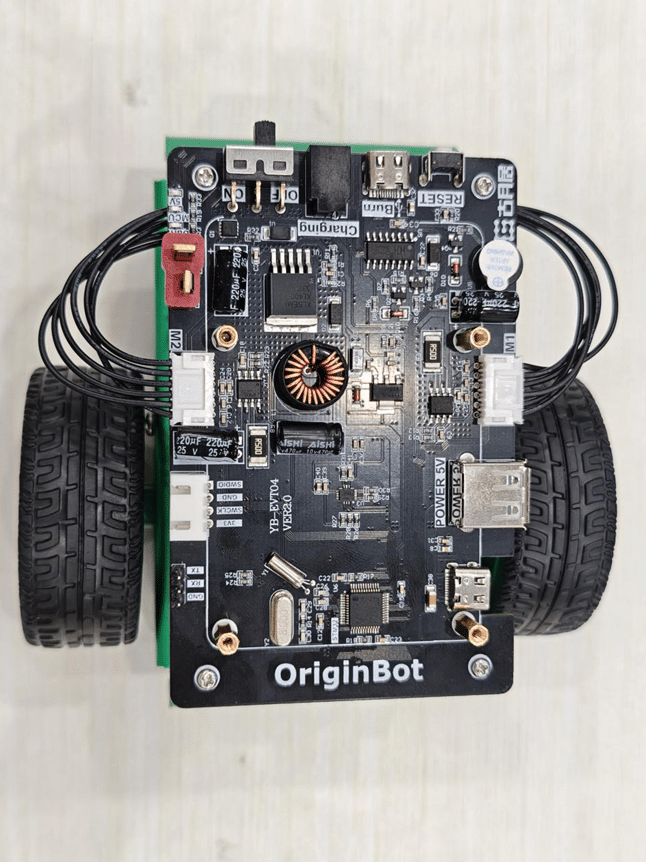 | 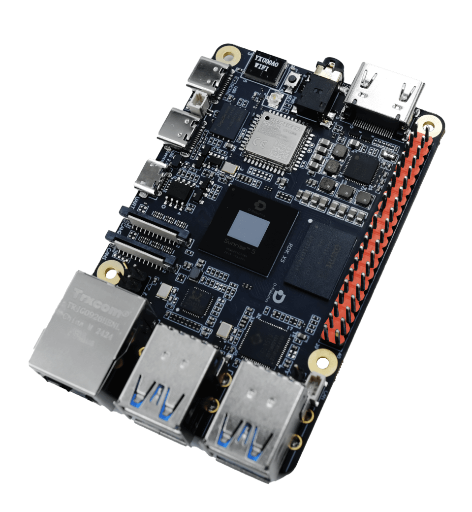 | 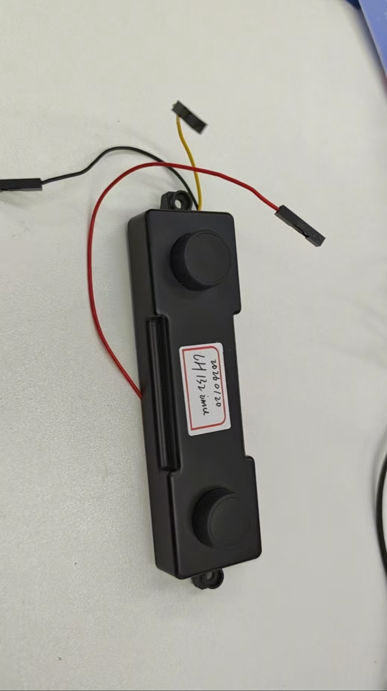 | → | 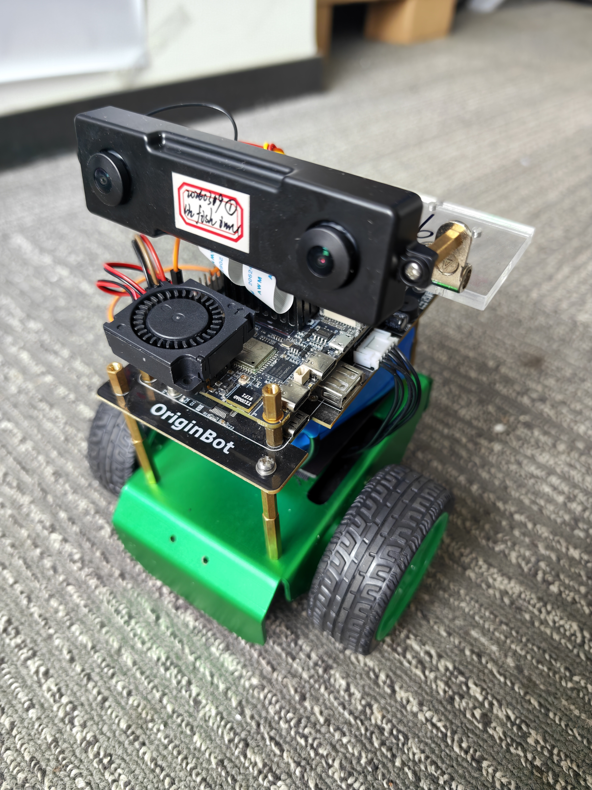 |

**纯视觉 & Lifelong & 实时 3D建图和导航效果：**


### 1.1 系统框架

整个系统只使用双目相机一个传感器，相机驱动已对双目RGB图像和IMU两种数据进行了时间同步。

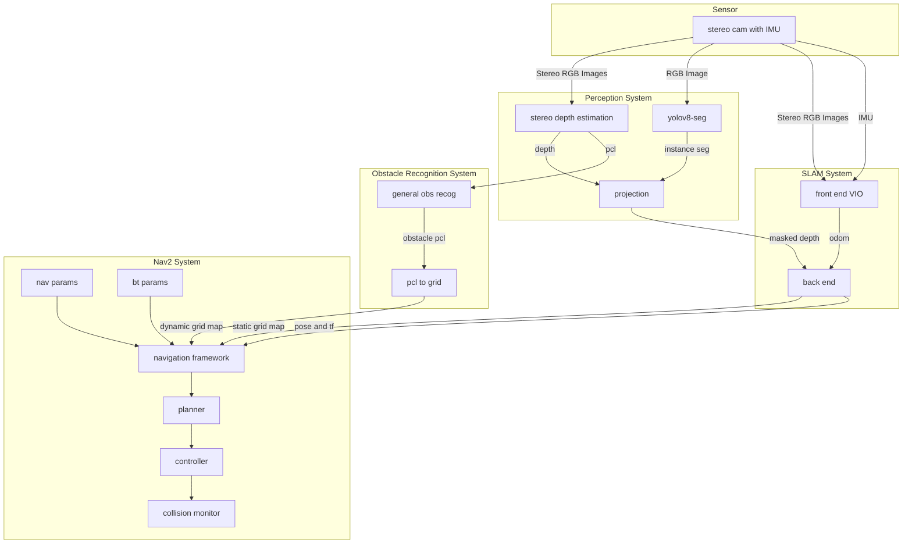
```mermaid
flowchart TD
    subgraph SRC[Sensor]
        cam[stereo cam with IMU]
    end

    subgraph PERC[Perception System]
        sde[stereo depth estimation]
        yolov8_seg[yolov8-seg]
        proj[projection]
    end

    subgraph SLAM[SLAM System]
        front_vio[front end VIO]
        back_end[back end]
    end

    subgraph OBS_REC[Obstacle Recognition System]
        gen_obs_recog[general obs recog]
        pcl2grid[pcl to grid]
    end

    subgraph NAV[Nav2 System]
        nav_params[nav params]
        bt_params[bt params]
        nav_frame[navigation framework]
        planner[planner]
        controller[controller]
        collision_mon[collision monitor]
    end

    %% 输入源分发
    cam -->|Stereo RGB Images| sde
    cam -->|RGB Image| yolov8_seg
    cam -->|Stereo RGB Images| front_vio
    cam -->|IMU| front_vio

    %% 感知系统内部流向
    sde -->|depth| proj
    yolov8_seg -->|instance seg| proj

    %% SLAM系统内部流向
    front_vio -->|odom| back_end

    %% 障碍物识别系统内部流向
    gen_obs_recog -->|obstacle pcl| pcl2grid

    %% 导航系统内部流向
    nav_params --> nav_frame
    bt_params --> nav_frame
    nav_frame --> planner
    planner --> controller
    controller --> collision_mon

    %% 跨系统数据交互
    sde -->|pcl| gen_obs_recog
    proj -->|masked depth| back_end
    pcl2grid -->|dynamic grid map| nav_frame
    back_end -->|static grid map| nav_frame
    back_end -->|pose and tf| nav_frame
```

### 1.2 双目深度估计

地瓜自研的采用GRU架构的双目深度估计算法，输入为双目图像数据，输出为左视图对应的视差图、深度图和点云，具有较好的数据泛化性和较高的推理效率。算法详细介绍：[双目深度算法](https://developer.d-robotics.cc/tros_doc/boxs/spatial/hobot_stereonet)。

| 双目左图和视差图（室内） | 双目左图和视差图（室外） | 点云 |
| :---: | :---: | :---: |
| 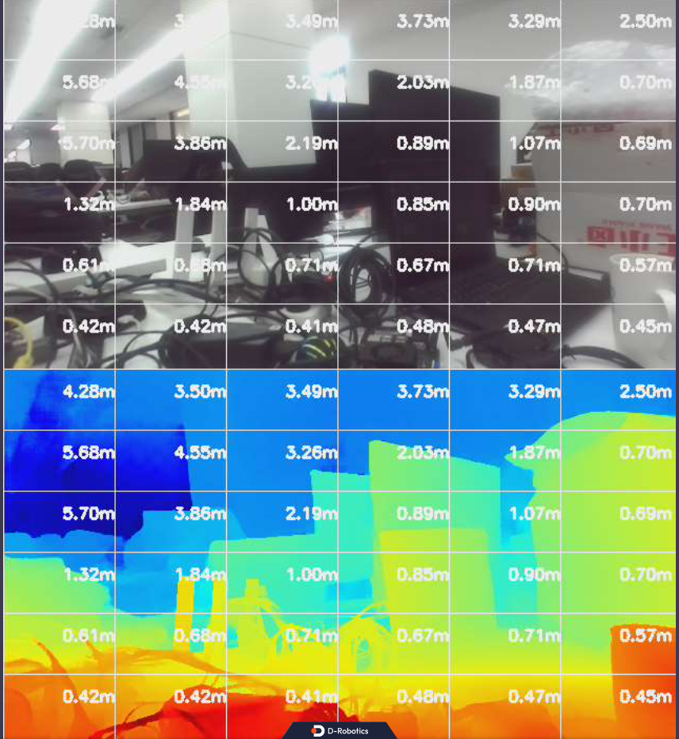 | 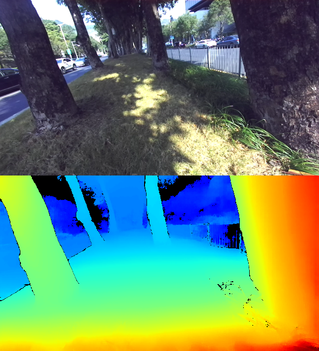 | 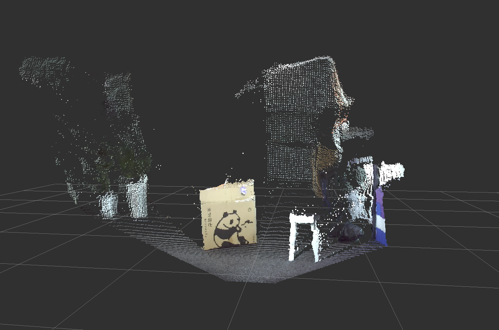 |

### 1.3 VSLAM

移动Solution中的VSLAM算法资源占用低（前端VIO占用1.5个CPU@8fps，后端回环和建图占用1个CPU），支持重定位，能够在动态场景下实时重建出场景的3D地图，可用于机器人6DoF位姿估计以及下游的导航和操作任务，同时具备Lifelong的能力。

#### 1.3.1 VIO

VSLAM前端是一个基于双目图像和 IMU 的视觉惯性里程计 (VIO) 算法，用于在线持续估计设备6DoF位姿、速度和轨迹，并输出可用于定位、可视化或下游融合的里程计结果。


#### 1.3.2 回环

VSLAM通过后端回环，消除前端VIO的累积误差，从而提升VIO的定位精度。

如下图，机器人移动4圈回到起点，轨迹总长度100米，每次回到起点map轨迹（有回环）都能闭合，里程计（无回环）轨迹持续漂移，最终里程计定位偏差为80cm。

| 回环轨迹（绿色）和里程计轨迹（蓝色） | 运动轨迹和回环 |
| :---: | :---: |
| 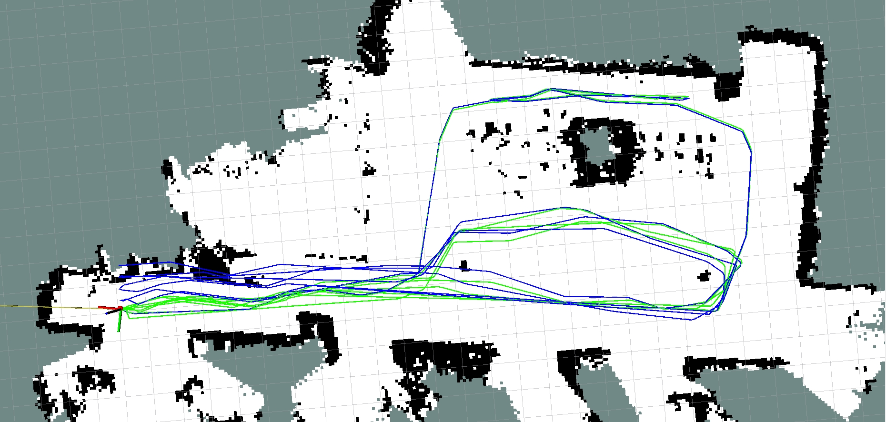 |  |

#### 1.3.3 3D建图

VSLAM支持构建3D地图，可用于机器人定位以及下游导航和操作任务。

| 3D地图 | 3D建图过程 |
| :---: | :---: |
| 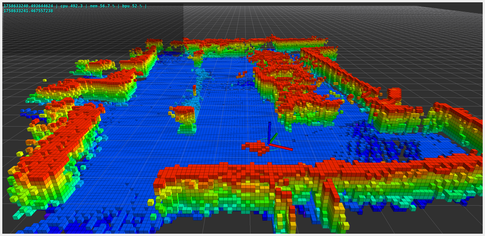 |  |

#### 1.3.4 重定位

支持机器人在启动时和劫持后的重定位。

如下图，机器人被劫持后，在7秒内完成重定位。


#### 1.3.5 动态障碍物去除

去除环境中的动态障碍物（例如室内的人），避免其干扰SLAM定位和建图。

如下图，人被识别为动态障碍物（地图中红色区域），未标记在SLAM的静态地图中（黑色区域）。


### 1.4 障碍物识别

提供了视觉语义障碍物识别和通用障碍物识别算法。

其中视觉语义障碍物识别算法能够识别出lidar无法识别的低矮/小尺寸障碍物，以及对应的障碍物语义信息。例如积木、书本、小玩偶等家庭常见障碍物。通用障碍物识别算法能够识别出一定尺寸范围的任意类别的障碍物。两种算法结合，保证了机器人能够识别出障碍物并绕障。

此外，障碍物识别具有低延迟的优势，保证了避障的及时性。从障碍物出现到识别成功并控制机器人，整个流程最大延迟为0.35秒（平均0.28秒），在机器人以0.2m/s速度移动的情况下，安全距离为7.0cm。

| 语义障碍物类别、尺寸和坐标信息 | 语义障碍物地图 | 通用障碍物点云 |
| :---: | :---: | :---: |
| 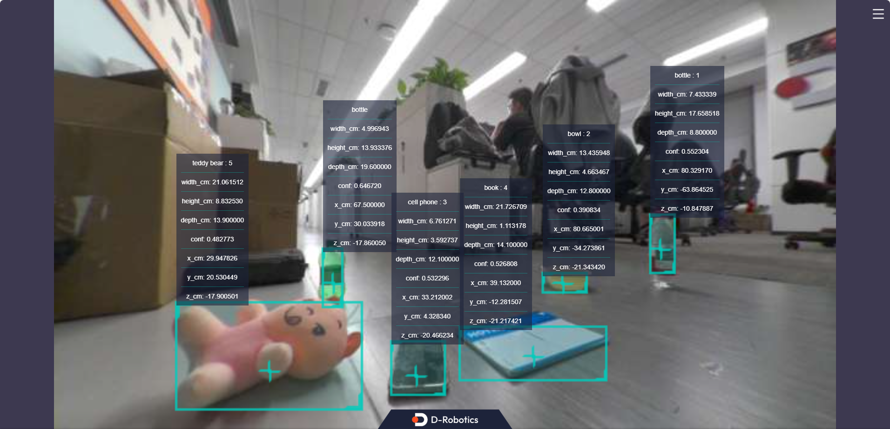 | 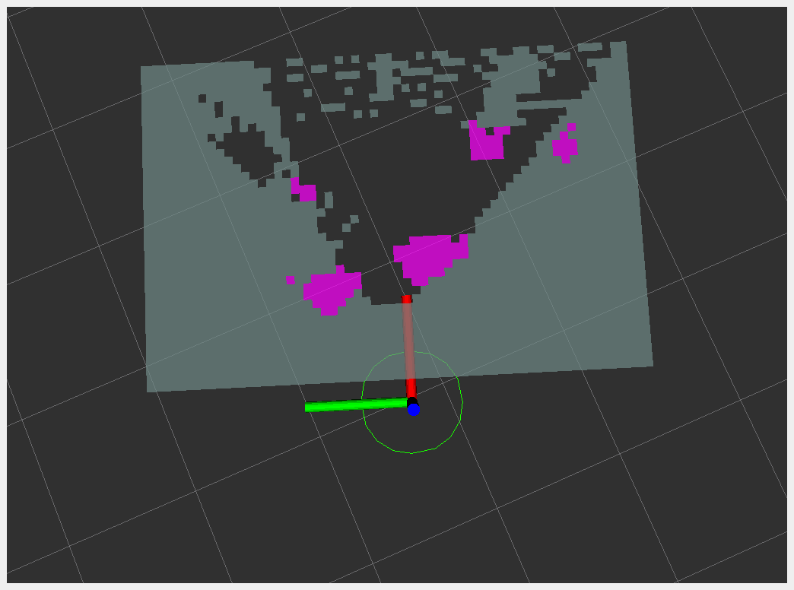 | 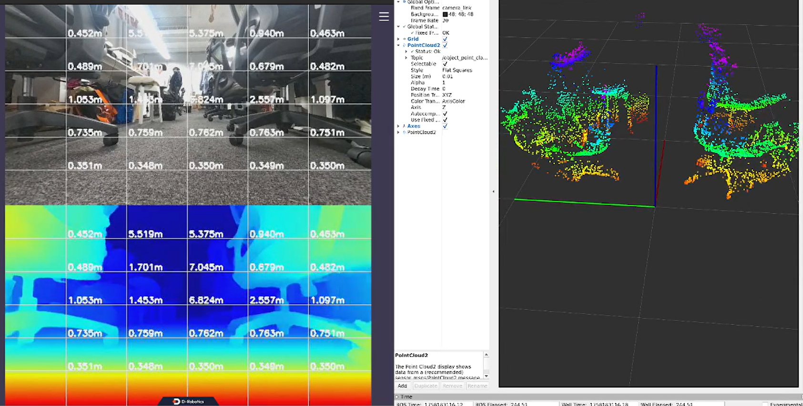 |

### 1.5 导航和避障

基于nav2框架，结合视觉传感器特性（相较于Lidar，相机FOV小），提供了深度优化的规划和避障算法，提升算法规划和避障的成功率和效率。

- 动态障碍物管理算法：引入障碍物的生命期管理和概率地图，提升避障和路径规划的成功率和效率。

- 环境探索算法：引入盲区地图和盲区探测算法，路径规划失败或者路径抖动情况下的路径搜索算法，解决由于相机视野盲区导致的碰撞问题。

- 优化的DWB控制算法：解决大转弯角度等特殊路径情况下轨迹规划失败的问题。

| 避障小物体 | 长距离导航 |
| :---: | :---: |
|  |  |


### 1.6 工具

移动Solution提供了多种用于开发和分析问题的工具，具体如下表：

|工具|功能|
| :---: | --- |
|数据采集工装|双目深度估计算法迭代。|
|云平台|数据标注和管理、算法训练、模型转换等全栈的算法和数据管理平台。|
|双目深度估计算法可视化评测工具|评测双目深度估计算法量化指标，以及可视化分析指标误差情况。|
|标定工具|双目相机内参标定；相机和机器人底盘外参标定。|
|轨迹规划算法分析工具|可视化DWB轨迹规划算法的计算过程和结果，用于优化轨迹规划算法功能。|
|运行时latency统计工具|统计时间窗口内功能模块的latency，包括模块的输出帧率，输入、处理和输出的平均、最大和最小延迟等数据，用于识别和优化系统pipeline的latency瓶颈。|
|rviz hud|将机器人的关键行为和系统状态信息，以overlay的形式在rviz上渲染。|
|探索建图|用于在未知环境下，通过主动探索环境进行建图。|
|数据trigger & recorder|用于路径规划时自动触发录制系统状态数据，通过离线回放数据定位问题，支持录制触发前的数据（影子模式）。|

| rviz hud（左上区域） | 未知环境下探索建图 | 离线回放trigger自动录制的数据 |
| :---: | :---: | :---: |
| 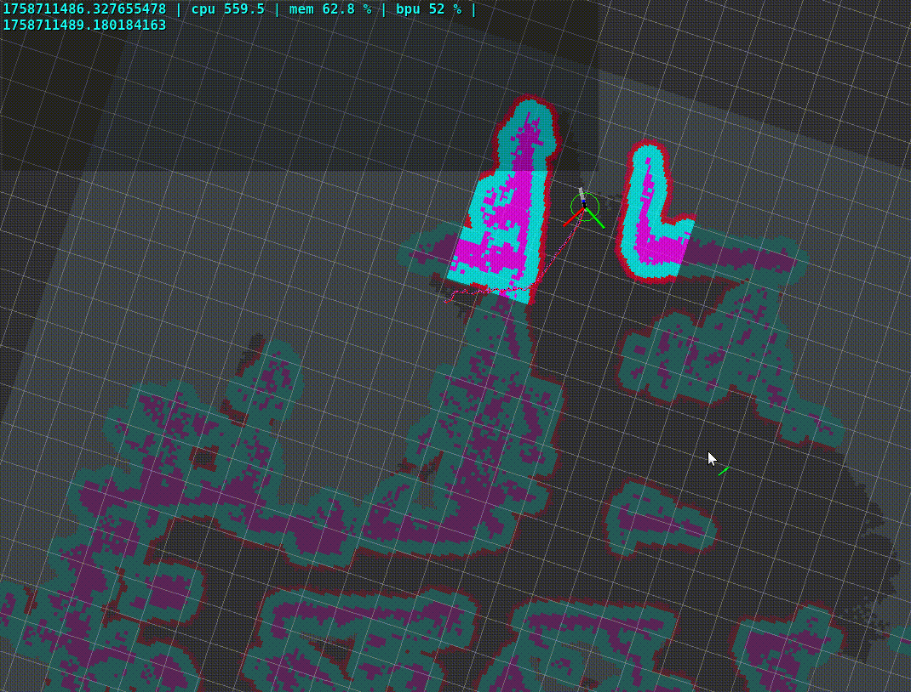 |  |  |

### 1.7 资源占用

|功能|CPU占用（注1）|BPU占用（%）|MEM占用（注2）|
| :---: | :---: | :---: | :---: |
|环境感知（注3）|150|51|320 MB（5%）|
|VSLAM|94|0|682 MB（9.6%）|
|规控|240|0|271 MB（3.8%）|
|总计|525（65.6%）|51|1273 MB（22.2%）|

注1：X5总共8核CPU，总CPU为800%。

注2：采用8G版本RDK X5，可用内存大小6.9GB。统计内存时已建地图面积110㎡，关键帧数量461。

注3：包含双目数据采集、双目深度估计算法、视觉语义障碍物识别算法和通用障碍物识别算法，图像采集频率8fps，gdc硬件resize。

- CPU占用统计命令：ps -aux --sort=-%cpu

例如统计规控算法总CPU占用：ps -aux --sort=-%cpu | grep "/opt/ros/humble/lib/nav2" | awk '{sum += $3} END {print sum}'

- BPU占用统计命令：hrut_somstatus

- MEM占用统计命令：top -b -n 1 -o %MEM

## 2. 套件清单

| [OriginBot移动底盘](https://class.guyuehome.com/p/t_pc/goods_pc_detail/goods_detail/SPU_ENT_16652164516Tu5oIXjFa3Vo) | [RDK Stereo Camera GS130WI](https://archive.d-robotics.cc/TogetheROS/files/vision_mobile_solution/docs/moduls/d_robotics_rdk_RDK_stereo_camera_gs130wi_zh_v1_1.pdf) | [RDK X5 8G](https://developer.d-robotics.cc/rdkx5) |
| :---: | :---: | :---: |
|  |  |  |

## 3. 安装硬件

### 3.1 安装双目相机

SC132GS双目相机安装在RDK X5上的方法参考手册[4.2. 硬件连接](https://developer.d-robotics.cc/tros_doc/boxs/spatial/stereo_imu_cam#42-%E7%A1%AC%E4%BB%B6%E8%BF%9E%E6%8E%A5)章节介绍。

### 3.2 安装RDK X5

参考OriginBot智能机器人开源套件的[安装处理器板卡](https://www.originbot.org/guide/hardware_setup.html#_9)章节内容，将RDK X5安装在OriginBot底盘上。

> **提示** 
给RDK X5供电的移动电源输出要求电压为5V，电流3A以上。
>

双目相机和RDK X5安装到OriginBot底盘上的效果图：


#### 安装到其他底盘

参考本页面【适配其他底盘】章节。

## 4. 软件配置

### 4.1 系统和TROS

RDK X5已安装Ubuntu 22.04 desktop系统镜像，已安装TROS并升级到最新版本。

- 基础环境配置参考RDK[入门配置](https://developer.d-robotics.cc/rdk_x_doc/Quick_start/configuration_wizard)
- 安装和升级TROS参考[安装和升级TROS](https://developer.d-robotics.cc/tros_doc/Quick_start/install_tros)

> **注意！请使用root用户名登录RDK X5。**
>
> **SSH登录建议** 建议PC使用Windows系统，并使用MobaXterm工具通过SSH连接RDK X5。
>

移动Solution套件版本依赖的TROS版本对应关系如下：

| 移动Solution套件版本号 | TROS版本号 |
| :---: | :---: |
| V0.0.5 | 2.5.2 |

移动Solution套件版本发布记录请查看本页面【版本发布记录】章节。查看版本方法参考【软件配置】章节。

查看当前TROS版本命令：`apt show tros-humble`，详细参考[查看当前TROS版本](https://developer.d-robotics.cc/tros_doc/Quick_start/install_tros#%E6%9F%A5%E7%9C%8B%E5%BD%93%E5%89%8Dtrosb%E7%89%88%E6%9C%AC)。

### 4.2 环境配置

#### 配置CPU为性能模式和超频

终端下执行以下命令：

```bash
echo "echo 1 > /sys/devices/system/cpu/cpufreq/boost" >> ~/.bashrc 
echo "echo performance > /sys/devices/system/cpu/cpu0/cpufreq/scaling_governor" >> ~/.bashrc 
echo "echo performance > /sys/devices/system/cpu/cpufreq/policy0/scaling_governor" >> ~/.bashrc
```

#### 配置ROS Domain ID

终端下执行以下命令：

```bash
# 使用命令export ROS_DOMAIN_ID=<your_domain_id>配置ROS Domain ID，其中<your_domain_id>的取值范围是[0, 101]
# 例如export ROS_DOMAIN_ID=42
# 将配置命令放在启动脚本中执行 
echo "export ROS_DOMAIN_ID=42" >> ~/.bashrc
```

#### 使用cyclonedds

终端下执行以下命令，将配置命令放在启动脚本中执行，使每个终端生效：

```bash
echo "export RMW_IMPLEMENTATION=rmw_cyclonedds_cpp" >> ~/.bashrc
```

### 4.3 安装依赖

#### 安装ROS功能包

在RDK X5上执行如下命令，安装必要的软件:

```bash
apt update 
apt upgrade -y 
apt install ros-dev-tools ros-humble-cyclonedds* ros-humble-rmw-cyclonedds* ros-humble-rviz* ros-humble-rtabmap* ros-humble-octomap-rviz-plugins ros-humble-teleop-twist-keyboard ros-humble-nav* ros-humble-robot-localization -y  
```

> **提示** 
1. 如遇到执行apt命令速度慢的问题，可以尝试使用社区中广受好评的第三方ROS安装工具，例如“小鱼的一键安装系列”（FishROS）。这些工具通常会处理好软件源配置、依赖安装等繁琐步骤。 
2. 例如使用“小鱼的一键安装系列”更新软件源命令：wget http://fishros.com/install -O fishros && bash fishros，选择[5] 一键配置:系统源，后续根据提示进行选择。配置完成后如果遇到apt安装ROS2包失败，请更新ros签名：sudo curl -sSL https://raw.githubusercontent.com/ros/rosdistro/master/ros.key -o /usr/share/keyrings/ros-archive-keyring.gpg。
3. 配置完成后如果遇到apt安装ROS2包失败，请更新ros签名：sudo curl -sSL  -o /usr/share/keyrings/ros-archive-keyring.gpg。 
>

#### 安装yq

安装yq，用于处理 YAML 的命令行工具。

```bash
wget https://github.com/mikefarah/yq/releases/latest/download/yq_linux_arm64 -O /usr/local/bin/yq 
chmod +x /usr/local/bin/yq 
yq --version
```

### 4.4 安装移动Solution

```bash
mkdir /userdata/vims 
mkdir /userdata/rtabmap 
cd /userdata/vims 
wget https://archive.d-robotics.cc/TogetheROS/files/vision_mobile_solution/install-vims-v0.0.5.tar.gz 
tar -zxvf /userdata/vims/install-vims-v0.0.5.tar.gz -C /userdata/vims
```

### 4.5 配置相机

#### 更新驱动

基于**RDK X5 3.5.0**版本系统，使用以下3个安装包更新驱动（拷贝到X5后使用dpkg -i hobot-*安装）。

[hobot-kernel-headers_3.0.4-20260514041655_arm64.deb](https://archive.d-robotics.cc/TogetheROS/files/vision_mobile_solution/deb/hobot-kernel-headers_3.0.4-20260514041655_arm64.deb)

[hobot-boot_3.1.0-20260514041708_arm64.deb](https://archive.d-robotics.cc/TogetheROS/files/vision_mobile_solution/deb/hobot-boot_3.1.0-20260514041708_arm64.deb)

[hobot-dtb_3.0.8-20260514041655_arm64.deb](https://archive.d-robotics.cc/TogetheROS/files/vision_mobile_solution/deb/hobot-dtb_3.0.8-20260514041655_arm64.deb)

#### 连接硬件

参考[4.2. 硬件连接](https://developer.d-robotics.cc/tros_doc/boxs/spatial/stereo_imu_cam#42-%E7%A1%AC%E4%BB%B6%E8%BF%9E%E6%8E%A5)。

#### 配置软件

参考[RDK X5配置](https://developer.d-robotics.cc/tros_doc/boxs/spatial/stereo_imu_cam#43-rdk-x5%E9%85%8D%E7%BD%AE)。

### 4.6 配置生效

reboot重启RDK X5，使配置生效。

### 4.7 查看软件版本号

软件安装完成后，RDK X5终端输入如下命令，查看套件版本号：

```bash
source /opt/tros/humble/local_setup.bash
source /userdata/vims/install/local_setup.bash
grep "<version>" `ros2 pkg prefix tros_vision_nav --share`/package.xml
```

输出如下信息（以0.0.1版本为例）：

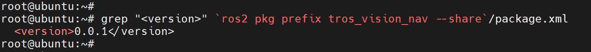

## 5. 基础功能测试

测试双目数据采集和深度估计。

安装完成双目相机后，RDK X5上运行如下命令，启动双目数据采集和深度估计：

```bash
source /opt/tros/humble/local_setup.bash
source /userdata/vims/install/local_setup.bash 
ros2 launch hobot_stereonet stereonet_model_web_visual_component_v2.4_int16_uncertainty.launch.py mipi_image_width:=640 mipi_image_height:=352 mipi_rotation:=0.0 mipi_cal_alpha:=0.0 need_rectify:=False mipi_image_framerate:=20.0
```

启动成功后，运行终端输出帧率统计信息（左下图）。PC端打开网页浏览器查看左目RGB图和深度图（右下图），在浏览器输入 `http://ip:8000` (图中IP为RDK的WIFI IP地址，例如192.168.1.100)。

| 运行终端输出的帧率统计信息 | PC端网页浏览器查看左目RGB图（上）和深度图（下） |
| :---: | :---: |
| 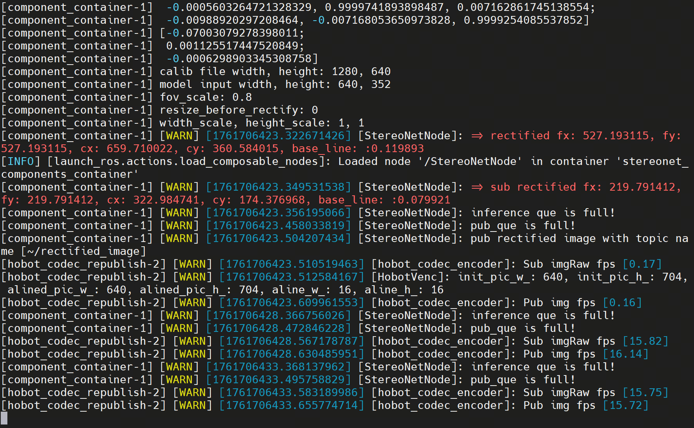 | 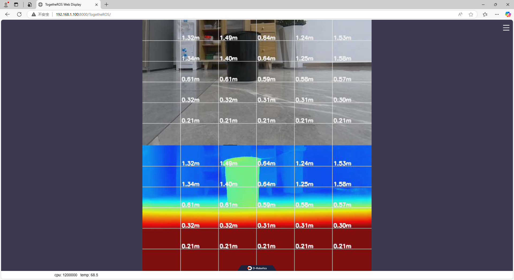 |

如果启动失败，请参考[双目深度算法使用手册](https://developer.d-robotics.cc/tros_doc/boxs/spatial/hobot_stereonet)排查问题。

> **如何验证双目相机的左右目是否连接正确** 
当相机的左右目接反时，程序能够正常运行，但是会导致深度估计错误。
遮住相机的左目，如果网页浏览器上显示的RGB图被遮挡，说明左右目接线正确。正确接线时，遮住左目图的现象如下：
>

| 遮住左目相机 | 网页浏览器上显示的RGB图被遮挡 |
| :---: | :---: |
| 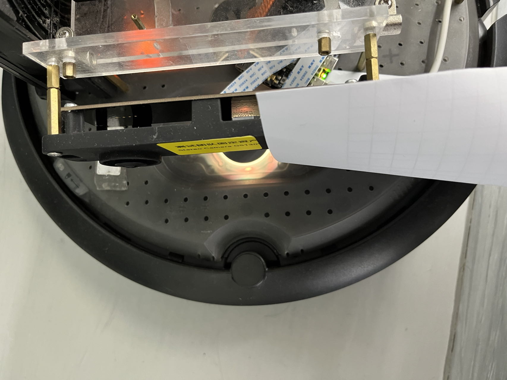 | 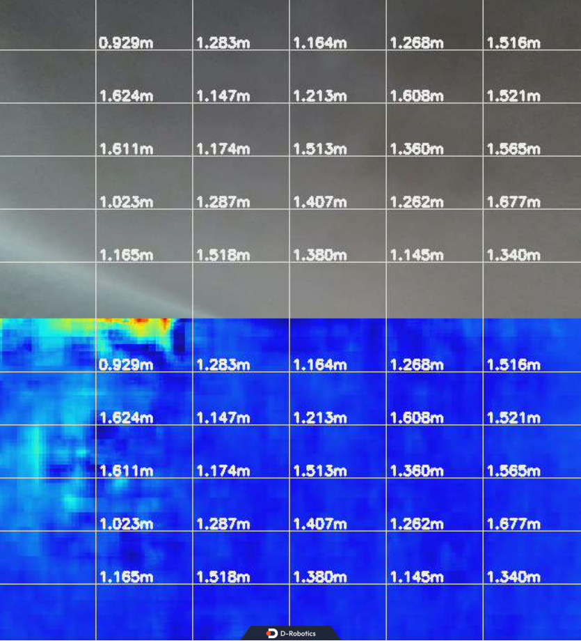 |

## 6. 外参标定

以下两种情况下，需要重新执行标定：
首次使用安装包，或者重新更新了安装包。
双目相机安装位置发生变化时。

### 6.1 相机和底盘外参标定（粗标定）
本章节介绍不依赖标定治具的情况下，实现相机和底盘之间x, y, x, roll, pitch外参的快速粗标定。
此方法无法标定yaw角，如果相机和底盘之间yaw角较大，请参考“5.3 相机和底盘外参标定（高精度标定）”章节进行标定。
简单、快速的粗标定能够满足基本使用需求，建议采用此标定方法。

#### 标定平移向量XY
使用尺子测量相机左目和底盘base_footprint之间的XY偏移（右手坐标系，X为机器人朝向的正前方，Y向左，Z向上）。
标定参数说明和标定方法，及其和配置参数的对应关系，示例工装的标定结果如下表：

| 标定参数 | 说明 | 配置参数 | 标定结果 |
| :---: | :---: | :---: | :---: |
| X偏移 | 双目相机左目相对于底盘两个轮子连线，X方向的偏移 | robot_to_camera_x | 0.145 |
| Y偏移 | 双目相机左目相对于底盘两个轮子连线的中心点，Y方向的偏移 | robot_to_camera_y | 0.022 |


修改配置文件中calibration的参数，设置平移向量：

```bash
# 打开配置文件
vi `ros2 pkg prefix tros_vision_nav --share`/params/params.yaml
# 使用标定结果设置 robot_to_camera_x  robot_to_camera_y
```

#### 标定旋转矩阵和平移向量Z

**准备环境**

将机器放置在平整地面上，前方1m范围内，左边、右边0.5m范围内没有任何障碍物。

#### 启动标定程序

打开RDK终端，启动环境感知：

```bash
source /opt/tros/humble/local_setup.bash
source /userdata/vims/install/local_setup.bash 
YAML_CONFIG_FILE=`ros2 pkg prefix tros_vision_nav --share`/params/params.yaml mipi_rotation=0.0 odom_type=wheel robot_base=originbot stereonet_pub_web=True run_perc=False run_slam=False run_nav=False run_explore=False run_mask_depth=False pcl_process_mode=1 pcl_in_pcl_frame_id=camera_link pcl_out_pcl_frame_id=camera_link pcl_filter_max_x=1.0 pcl_filter_max_y=0.5 pcl_filter_min_y=-0.5 pcl_filter_min_z=-1.0 max_obstacle_height=2.0 bash `ros2 pkg prefix tros_vision_nav --share`/launch/run_launch.sh
```

此时PC打开WEB浏览器（chrome/firefox/edge）输入 http://IP:8000（IP为RDK IP地址），能够查看到相机画面。
RVIZ上，将坐标系设置为base_link/base_footprint，勾选PclObstacle，移动底盘，确保rviz上渲染的点云是平面。

| WEB可视化 | RVIZ可视化 |
| :---: | :---: |
| 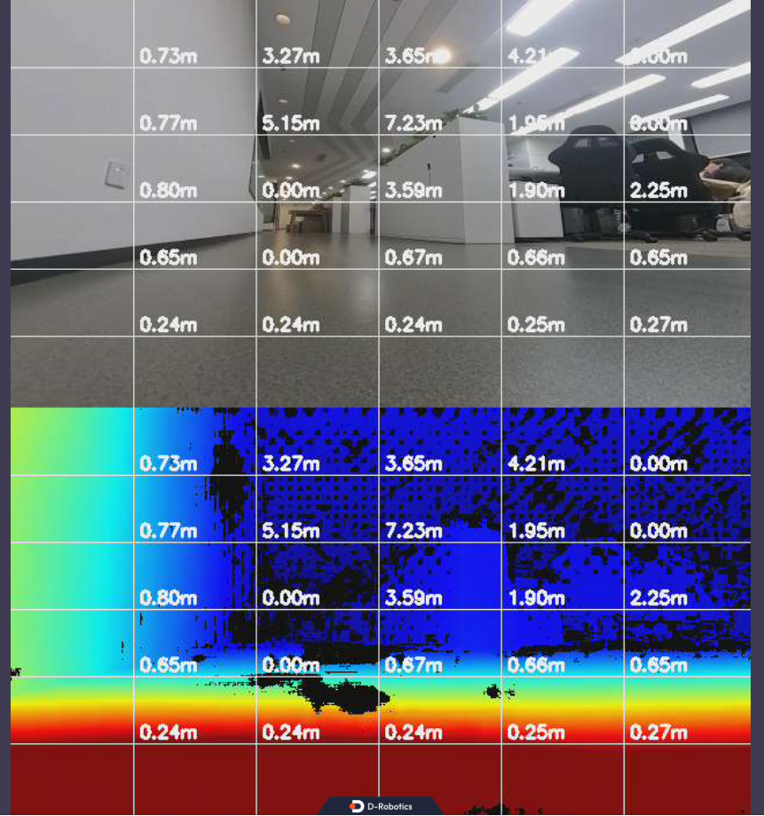 | 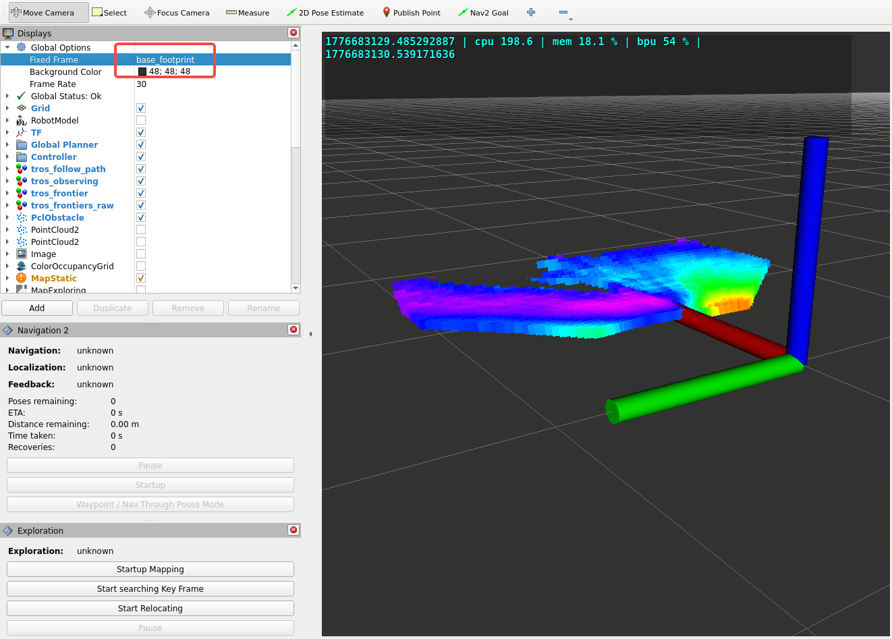 |

#### 更新标定参数
RDK终端将会打印如下标定结果信息：

```bash
[tros_container-2] [WARN] [1776682622.617492624] [pcl_filter]: Sensor Roll: 0.014, 0.792°, Pitch: 0.133, 7.622°, Camera Height: 0.146 m 
[tros_container-2] [WARN] [1776682622.617754583] [pcl_filter]: You can set tf with cmd: 'run tf2_ros static_transform_publisher --roll -0.014 --pitch -0.133 --x 0.0 --y 0.0 --z 0.146 --frame-id base_footprint --child-frame-id camera_link'
```

说明标定出来的相机距离地面高度（Camera Height）为0.146 m。

修改配置文件中calibration的参数，使用log中run tf2_ros static_transform_publisher提示的--roll和--pitch设置旋转矩阵，使用Camera Height（--z）设置robot_to_camera_z：

```bash
# 打开配置文件
vi `ros2 pkg prefix tros_vision_nav --share`/params/params.yaml
# 使用标定结果中的roll和pitch设置 robot_to_camera_roll robot_to_camera_pitch
# 使用Camera Height（--z）设置robot_to_camera_z
```

#### 使用（验证）标定参数
停止终端下的程序，将机器放置在平整地面上，前方1m范围内，左边、右边0.5m范围内没有任何障碍物。运行如下命令：

```bash
source /opt/tros/humble/local_setup.bash
source /userdata/vims/install/local_setup.bash 
YAML_CONFIG_FILE=`ros2 pkg prefix tros_vision_nav --share`/params/params.yaml stereonet_pub_web=True pcl_en_debug=True run_perc=False run_slam=False run_nav=False run_explore=False run_mask_depth=False pcl_filter_max_y=0.5 pcl_filter_min_y=-0.5 bash `ros2 pkg prefix tros_vision_nav --share`/launch/run_launch.sh
```

终端输出如下log，说明标定正确：

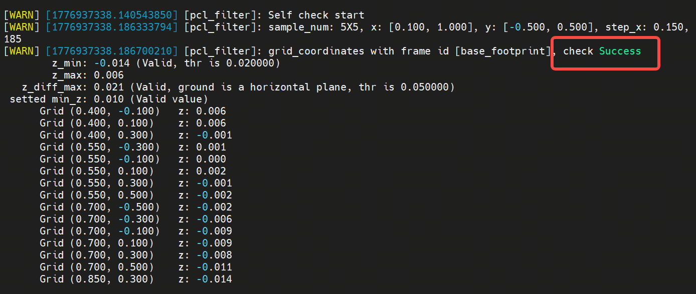

RVIZ上，将坐标系设置为base_link/base_footprint，勾选PclObstacle。在机器人前方摆放障碍物，可以看到识别出的方盒和水瓶两种障碍物的点云：

| WEB可视化 | RVIZ可视化 |
| :---: | :---: |
| 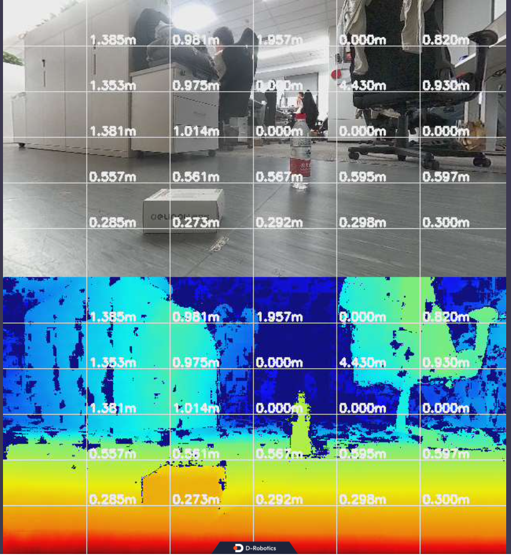 | 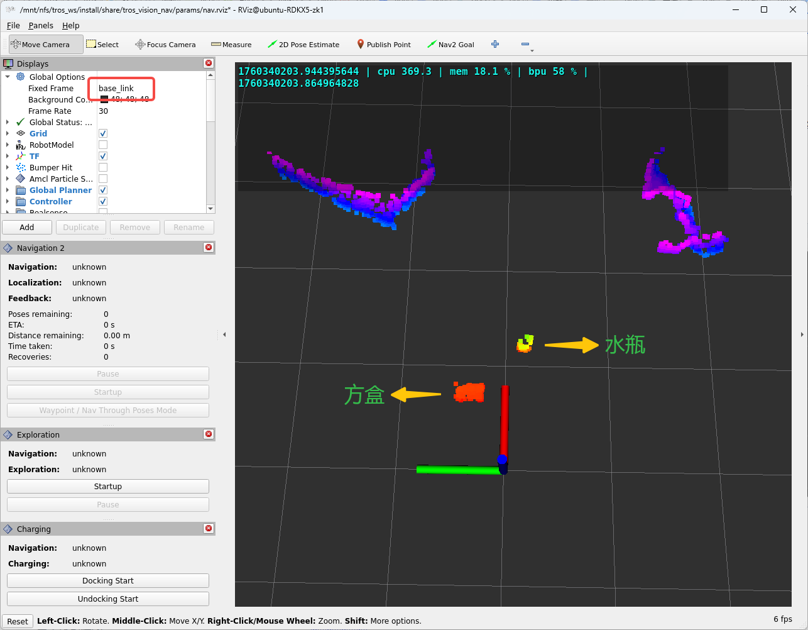 |

### 6.2 底盘高度标定
通过标定，得到底盘的高度，用于过滤高于底盘的障碍物，使机器人能够从高于底盘的障碍物下方通过（例如从桌子下面穿过）。不同工装对应的参数不同。

**开始标定**

底盘安装完成后，使用尺子测量底盘最上方和地面之间的高度。例如对于如下图工装，测量出来的底盘高度为0.22m。为了使机器人能够顺利避障高出障碍物，选取0.25m作为底盘高度。

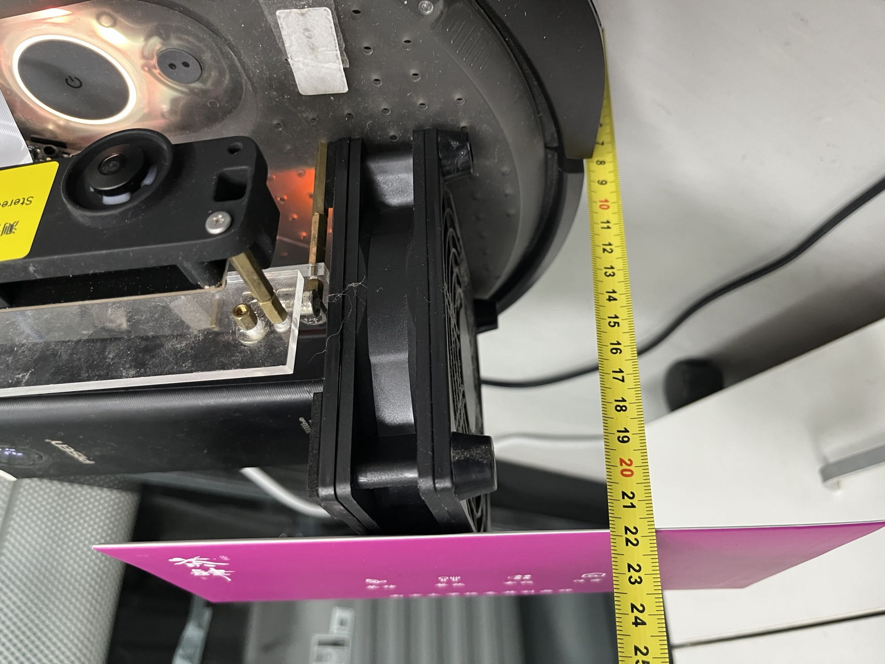

标定出来的参数用于设置配置文件中参数：rtabmap_Grid_MaxObstacleHeight:="'0.25'" max_obstacle_height:=0.25。

```bash
# 打开配置文件
vi `ros2 pkg prefix tros_vision_nav --share`/params/params.yaml
# 使用标定结果设置 rtabmap_Grid_MaxObstacleHeight max_obstacle_height
```

#### 使用（验证）标定参数
在机器人正前方，摆放不同高度障碍物，用于验证标定结果。
打开RDK X5终端，运行如下命令，包含环境感知，和rviz可视化：

```bash
source /opt/tros/humble/local_setup.bash
source /userdata/vims/install/local_setup.bash
YAML_CONFIG_FILE=`ros2 pkg prefix tros_vision_nav --share`/params/params.yaml stereonet_pub_web=True run_nav=False run_explore=False rtabmap_Grid_3D="'true'" bash `ros2 pkg prefix tros_vision_nav --share`/launch/run_launch.sh
```

RVIZ上分别打开3D地图和障碍物点云的渲染，如下图：

| 3D地图 | 障碍物点云 |
| :---: | :---: |
| 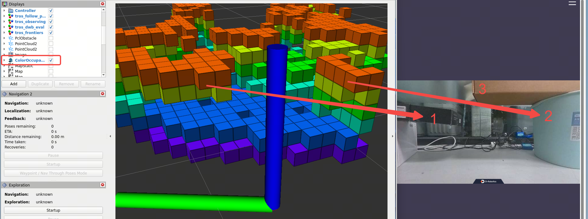 | 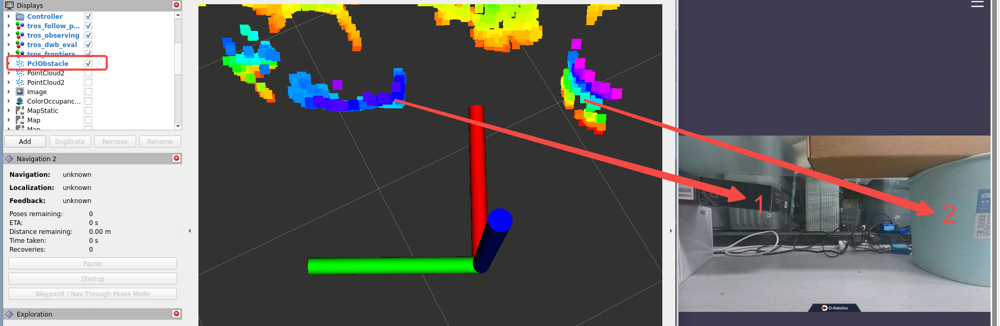 |

其中障碍物1离地高度0.18m（低于阈值0.25m），障碍物3离地高度0.27m（高于阈值0.25m）。可以看到地图和点云只有障碍物1的渲染，无障碍物3，说明标定参数生效。

### 6.3 相机和底盘外参标定（高精度标定）

如果相机和底盘之间yaw角较大，或者对标定精度有极高要求，请参考[相机和底盘外参标定（高精度标定）](calibration.html)进行标定。

## 7. 应用示例

### 7.1 Checklist

运行应用示例前，请先检查是否已经完成必要的基础配置项，并已更新到配置文件：

```bash
`ros2 pkg prefix tros_vision_nav --share`/params/params.yaml
```

| 基础配置项 | 参数 | 配置方法 |
| :---: | :---: | :---: |
| 相机和底盘外参 | robot_to_camera_x <br> robot_to_camera_y <br> robot_to_camera_z <br> robot_to_camera_roll <br> robot_to_camera_pitch | 【相机和底盘外参标定】章节 |
| 底盘高度 | rtabmap_Grid_MaxObstacleHeight <br> max_obstacle_height | 【底盘高度标定】章节 |
| 验证标定参数 | —— | 【相机和底盘外参标定】章节中**使用（验证）标定参数**小节 |

> **提示：** 
如未使用套件默认的硬件，即存在如下任意一种情况，请完成下面表格中的**额外配置项**。
1. 未使用 OriginBot 底盘
2. 未使用 70mm 基线双目相机
3. 未使用 VIO 模式，使用轮式里程计
>

| 额外配置项 | 参数 | 配置方法 |
| :---: | :---: | :---: |
| 底盘类型 | robot_base | 根据机器人底盘类型选择 |
| 相机参数 | mipi_rotation | 70mm基线（带IMU）相机设置为0.0，其他相机设置为90.0 |
| 里程计类型 | odom_type | wheel/vio |
| 运动类型 | rtabmap_Reg_Force3DoF | vio 模式设置 False，wheel 模式选择 True |
| 运动类型 | rtabmap_Mem_UseOdomGravity | vio 模式设置 True，wheel 模式选择 False |

> **注意：** 
1. 基于点云的通用障碍物识别算法，默认开启了自适应阈值（`params.yaml`配置文件中的`en_pcl_filter_min_z_auto_adjust`配置项），即启动时自动计算并更新阈值。 
2. 启动时要求机器放置在**平整、无反光**地面上，地面上可以存在障碍物，但是机器人正前方[0.3米, 1.0米]范围内至少存在一块15cm*15cm的无障碍物区域。
>

### 7.2 双目视觉里程计（VIO）
本章节介绍如何启动双目视觉里程计，并可视化机器人的移动轨迹。
#### 启动VIO
打开RDK X5终端，运行如下命令，包含双目深度估计，VIO，rviz可视化：

```bash
source /opt/tros/humble/local_setup.bash
source /userdata/vims/install/local_setup.bash
YAML_CONFIG_FILE=`ros2 pkg prefix tros_vision_nav --share`/params/params.yaml odom_type=vio stereonet_pub_web=True run_pcl2grid=False run_rviz=True run_perc=False run_slam=False run_nav=False run_explore=False run_mask_depth=False bash `ros2 pkg prefix tros_vision_nav --share`/launch/run_launch.sh
```

#### 配置RVIZ
RVIZ上，将坐标系设置为base_link，勾选traj_odom，并选择topic为/drobotics_vio/pathimu。

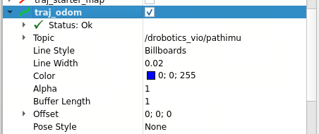

#### 启动键盘控制
打开RDK X5终端，运行如下命令，启动键盘控制功能包，用于使用键盘控制机器人移动：

```bash
source /opt/tros/humble/local_setup.bash
ros2 run teleop_twist_keyboard teleop_twist_keyboard
```

**测试**

使用键盘控制机器人移动，rviz上将会渲染机器人移动轨迹：

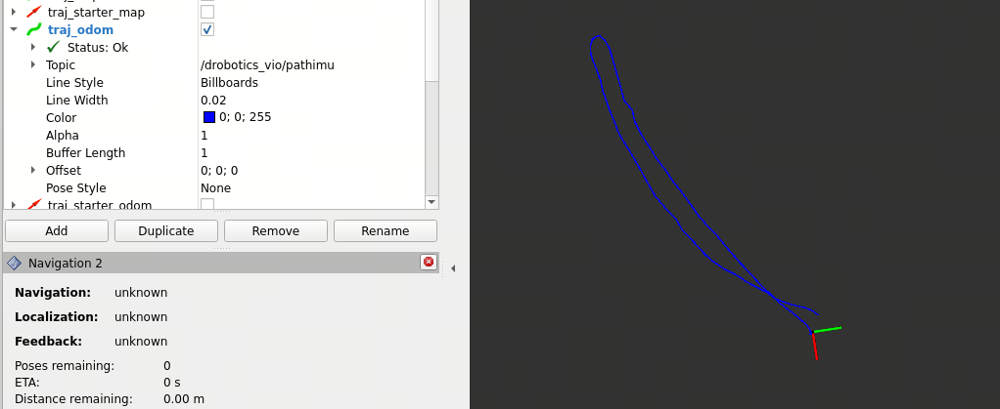

### 7.4 VSLAM建图

本章节介绍如何使用VSLAM生成用于导航的2D地图。

#### 启动solution

打开RDK X5终端，运行如下命令，包含环境感知，VSLAM，导航，自主探索建图，rviz可视化：

```bash
source /opt/tros/humble/local_setup.bash
source /userdata/vims/install/local_setup.bash
mkdir -p /userdata/rtabmap/ 
# 删除地图文件
rm /userdata/rtabmap/office.db 
YAML_CONFIG_FILE=`ros2 pkg prefix tros_vision_nav --share`/params/params.yaml bash `ros2 pkg prefix tros_vision_nav --share`/launch/run_launch.sh
```

> **提示** 
1. 当Rviz上渲染出地图，并且Exploration状态为IDLE时，表示启动完成，可以开始启动自主探索建图。 
2. 建图过程中，rviz上（下图）会渲染SLAM回环发生时刻（loop_closure at stamp，只显示了时间戳秒部分）、地图面积（map known aera）和距离上次回环机器人的移动轨迹长度（to last loop_closure traj len）。
3. 当距离上次回环的轨迹长度超过5米时，将会自动暂停自主探索，控制机器人回到已建图区域，使其发生回环，避免由于累积误差过大导致地图出现偏差。
4. 发生回环后，rviz上将会刷新回环发生时刻，以及轨迹长度，此时可以恢复自主探索建图。 完成建图后，如发现地图存在偏移或者其他明显错误，需要通过导航或者手动控制机器人到错误地图处更新地图。 
5. 默认关闭3D建图，启动建图时使用参数打开：rtabmap_Grid_3D="'true'"。开启3D建图将会导致回环检测速度显著变慢，请根据实际需求选择是否开启3D建图。
>

| 启动完成后rviz端的渲染 | 自主探索建图中rviz端的渲染 |
| :---: | :---: |
| 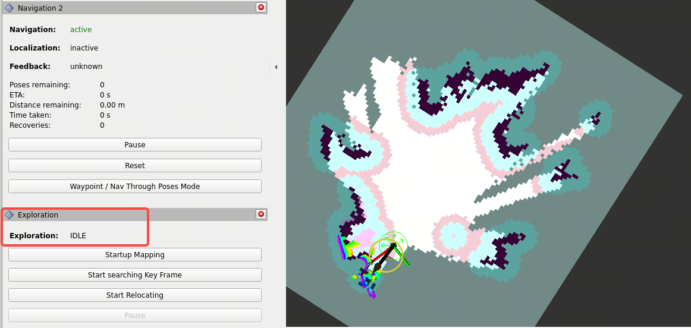 | 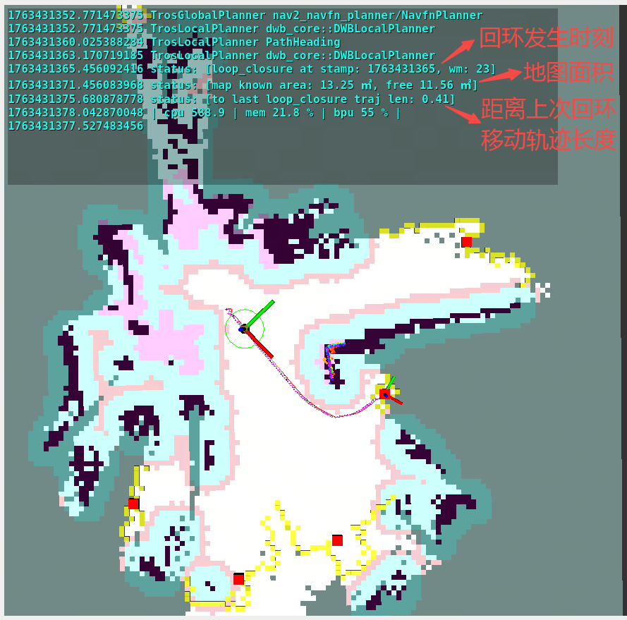 |

#### 配置RVIZ

RVIZ上，将坐标系设置为map。

#### 自主探索建图

在RVIZ上启动自主探索建图：

| rviz自主探索建图按键说明 | 自主探索建图过程 |
| :---: | :---: |
| 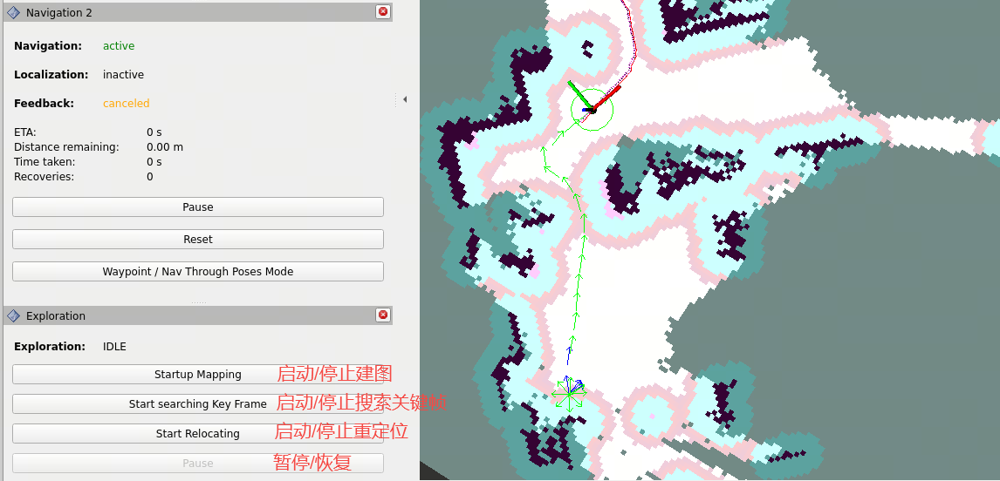 | 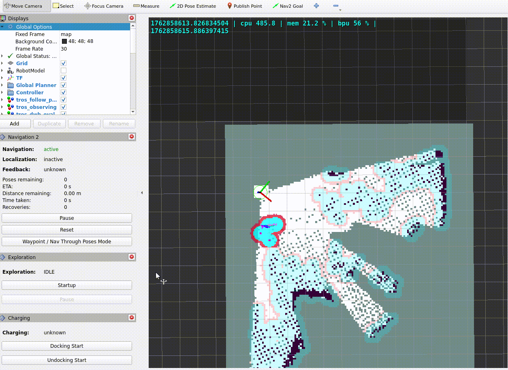 |


> 提示 
1. 自主探索建图过程中，选择Pause（暂停）按键将会暂停探索，并将本次探索目标位置加入灰名单，选择Resume（继续）按键将会选择一个新的目标位置进行探索。
2. 当所有目标都探索完成后，将会清除灰名单中的目标。
3. 自主探索建图过程中，如果需要跳过当前探索目标，可以使用Pause（暂停）功能。
>

#### 手动控制建图

打开终端，启动键盘控制功能包，使用键盘控制机器人移动实现建图：

```bash
source /opt/tros/humble/local_setup.bash
ros2 run teleop_twist_keyboard teleop_twist_keyboard 
```

**地图面积**

建图过程中，rviz上将会实时显示地图面积：

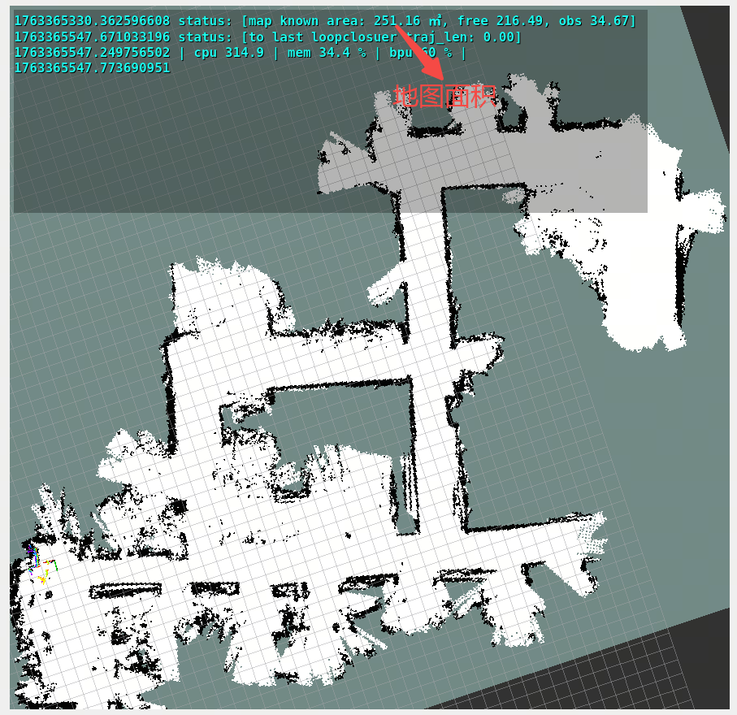

### 7.5 导航和避障

本章节介绍如何使用已经创建好的地图进行导航和避障。

#### 启动solution

打开RDK X5终端，运行如下命令，包含环境感知，VSLAM，导航，重定位，rviz可视化：

```bash
source /opt/tros/humble/local_setup.bash
source /userdata/vims/install/local_setup.bash
YAML_CONFIG_FILE=`ros2 pkg prefix tros_vision_nav --share`/params/params.yaml bash `ros2 pkg prefix tros_vision_nav --share`/launch/run_launch.sh
```

> **提示** 
建图和定位两种模式的启动命令相同，solution内部根据当前环境和系统状态，自动切换模式。
>

#### 启动时重定位

定位模式下，SLAM启动后，机器人将会自动进入到重定位状态，定位成功后RVIZ上显示如下启动重定位成功信息：

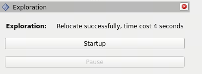

#### 绑架后重定位

定位模式下，抬起机器人，搬移到新位置并放回地面上后，机器人将会自动进入到重定位状态，重定位中和重定位成功后RVIZ上显示如下信息：

| 重定位中 | 重定位成功 |
| :---: | :---: |
| 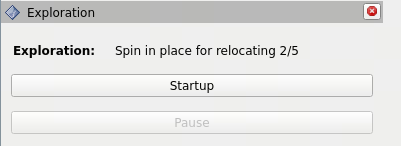 | 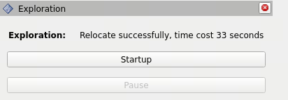 |

重定位过程：


**导航效果**

在RVIZ上选择导航的目标点，导航过程和完成后的结果如下：


### 7.6 人机交互[TODO]

## 8. 适配其他底盘

本章节介绍将基于VIO算法的移动Solution套件迁移到其他底盘的方法（如自研底盘myrobot）。
以下以自研底盘（myrobot）举例介绍适配底盘方法。

### 8.1 前置条件

- 由于采用VIO作为里程计，底盘只需要电机，无需编码器和IMU。
- 已完成通过MCU控制自研底盘电机。
- 已完成基于ROS2 Humble版本的电机驱动功能（例如功能包为myrobot_base）开发。并且能够使用ROS2的键盘遥控工具（teleop_twist_keyboard功能包），通过键盘发送控制指令来操作机底盘移动。

### 8.2 连接硬件

将RDK X5和相机固定到自研底盘上。

使用串口通信线连接MCU控制器和RDK X5。其中RDK X5的串口GND, TX, RX分别对应的6, 8, 10管脚。

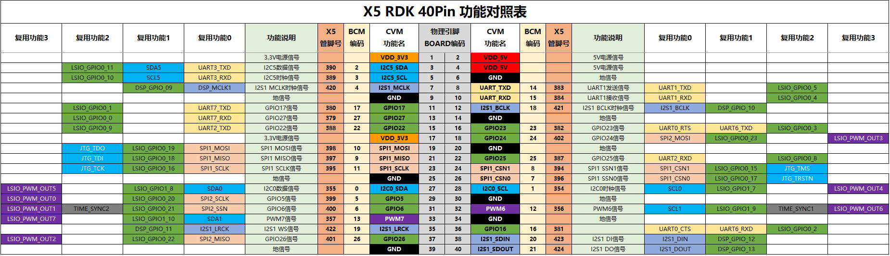

### 8.3 安装软件

将ROS2 Humble版本的电机驱动功能（myrobot_base功能包）迁移到RDK X5上。

RDK X5上运行myrobot_base功能包。

RDK X5上运行ROS2的键盘遥控工具：

```bash
ros2 run teleop_twist_keyboard teleop_twist_keyboard
```

通过键盘能够正常控制底盘运动，说明硬件连接和软件安装成功。

### 8.4 外参标定

参考【外参标定】章节完成相机和底盘之间的外参标定。

### 8.5 适配移动Solution

打开启动脚本文件

```bash
`ros2 pkg prefix tros_vision_nav --share`/launch/bringup.launch.py
```

修改如下图：

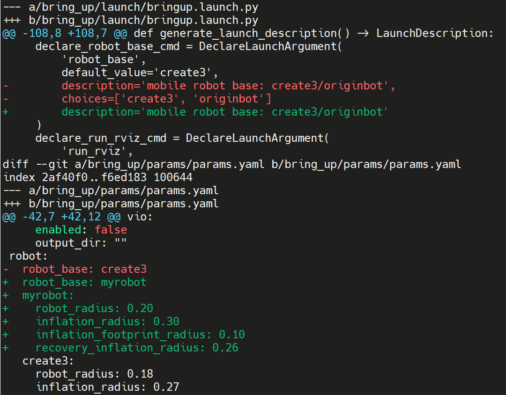

打开配置文件
```bash
`ros2 pkg prefix tros_vision_nav --share`/params/params.yaml
```
 
新增如下配置（以机器人底盘半径为0.20米举例），效果如上图：

```bash
robot:
  robot_base: myrobot
  myrobot:
    robot_radius: 0.20
    inflation_radius: 0.30
    inflation_footprint_radius: 0.10
    recovery_inflation_radius: 0.26
```

其中robot_radius为底盘半径，其他参数建议值如下：
- inflation_radius: robot_radius * 1.5
- inflation_footprint_radius: robot_radius * 0.5
- recovery_inflation_radius: robot_radius * 1.3

### 8.6 运行移动Solution

RDK X5上启动base_link和base_footprint 之间的tf变换，z的值为底盘轮子半径：

```bash
ros2 run tf2_ros static_transform_publisher --frame-id base_link --child-frame-id base_footprint --z -0.05
```

RDK X5上启动电机驱动功能myrobot_base，例如：

```bash
ros2 run myrobot_base myrobot_base
```

参考【应用示例】章节的【Checklist】小节检查参数是否全部完成配置后，即可运行【应用示例】章节示例。

## 9. 版本发布记录

### 版本号：0.0.5

TODO

## 10. FAQ
详见 [FAQ](faq.html)
